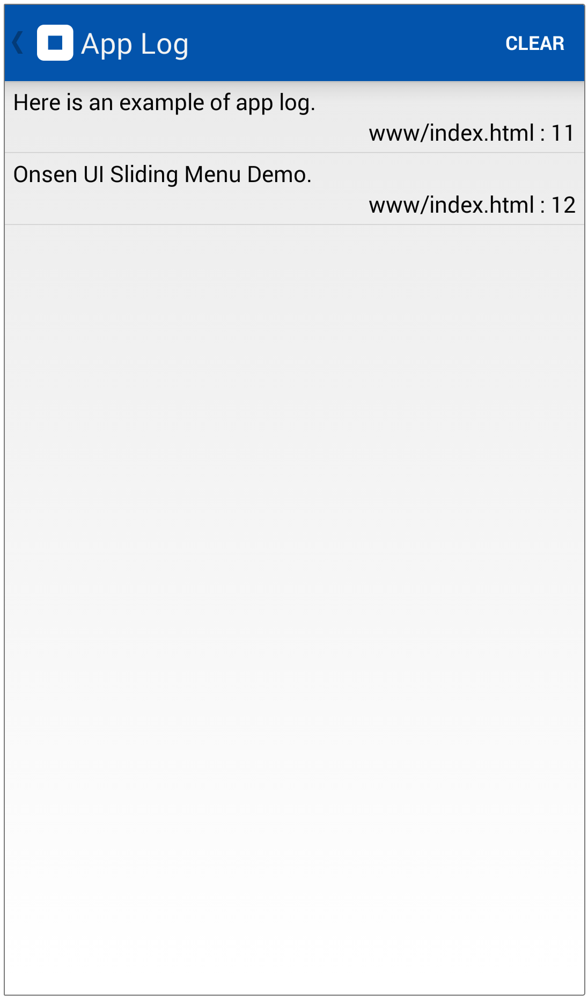
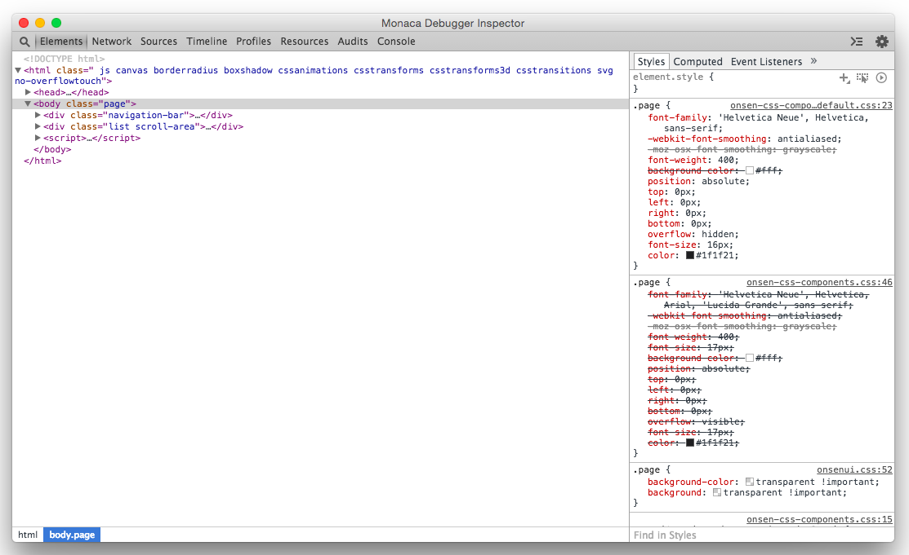
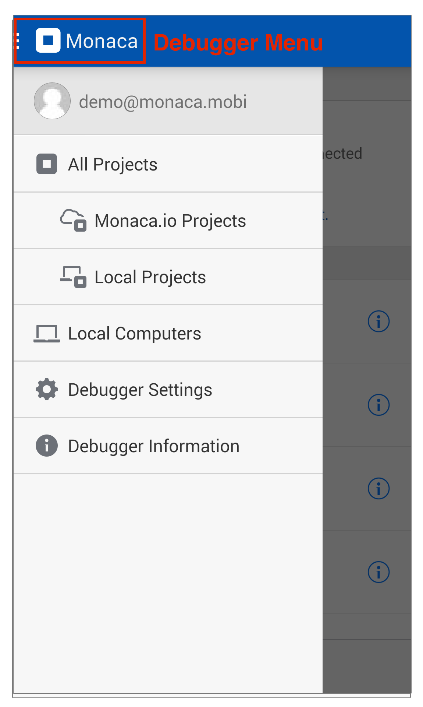

.. _monaca_debugger_features:

================================================
Functionalities
================================================

.. rst-class:: right-menu

.. _debugger_functions:

Debugger Functions
==========================

Monaca Debugger provides useful functions for testing/debugging your apps. You can find Debugger Functions button when you run a project in Monaca Debugger. When you click on Debugger Functions button, you will see:

- Back button

- Reload button

- :ref:`Screenshot button <screenshot>`

- :ref:`Chat button <chat>`

- :ref:`App Log button <app_log>`

- :ref:`Inspector button <debugger_inspector>`

  .. figure:: images/features/1.png
    :width: 250px
    :align: left

  .. figure:: images/features/2.png
    :width: 250px
    :align: left

  .. rst-class:: clear

.. _screenshot:

Screenshot
^^^^^^^^^^^^^^^^^^^^

While running your project on Monaca Debugger, you may want to send any specific screenshot of your project to Monaca Cloud IDE and share it with your team members.

In the screenshot screen, you can:

- edit the screenshot.

- upload to Cloud IDE.

- save to phone storage.
  
  .. figure:: images/features/4.png
    :width: 250px
    :align: left

  .. rst-class:: clear

.. _chat:

Chat
^^^^^^^^^^^^^^^^^^^^

Chat function allows you to share conversations with your team members of a shared project or between Monaca Debugger and Cloud IDE. The screenshot below shows a conversation between Monaca Debugger and Cloud IDE.

  .. figure:: images/features/5.png
     :width: 250px
     :align: left

     Monaca Debugger

  .. figure:: images/features/6.png
     :width: 241px
     :align: left

     Monaca Cloud IDE

  .. rst-class:: clear

.. _app_log:

App Log
^^^^^^^^^^^^^^^^^^^^^^^

Monaca Debugger allows you to see the log of the app which will show the progress and errors of the app while running.

.. rst-class:: clear

.. _debugger_inspector:

Inspector
^^^^^^^^^^^^^^^^^^^^^^^

Inspector function allows you to debug/inspect your project using `Chrome Dev Tools <https://developer.chrome.com/devtools/index>`_. Before started, you need to enable USB debugging on your device. 

.. rst-class:: clear

.. note:: Inspector function is only available when you are using :ref:`Monaca Localkit <monaca_localkit_index>` or :ref:`Monaca CLI <monaca_cli_index>`. Please refer to :ref:`USB debugging with Monaca Localkit <localkit_debug_app>` or :ref:`USB debugging with Monaca CLI <cli_debug_app>`.

.. _debugger_menu:

Debugger Menu
==========================

.. rst-class:: clear

Inside Debugger Menu, there are:

- *All Projects*: shows a list of all Monaca projects which can be run on Monaca Debugger. There are two types of projects in Monaca Debugger such as:

  1. Monaca.io projects: projects created in Monaca Cloud IDE.
  2. Local projects: projects created in :ref:`Monaca Localkit <monaca_localkit_index>` or :ref:`Monaca CLI <monaca_cli_index>` and stored in your local PC. Local projects appear only when the debugger is paired with Monaca Localkit/CLI.

    .. figure:: images/features/9.png
        :width: 250px
        :align: left
    .. rst-class:: clear

- *Local Computers*: shows a list of all currently paired and available computers. Paired computers are local computers running Monaca Localkit/CLI and currently connected to the debugger. You may want to refer to the following pages:

  1. :ref:`Pairing Monaca Debugger with Monaca Localkit <localkit_pairing_debugging>`
  2. :ref:`Pairing Monaca Debugger with Monaca CLI <connect_to_debugger>`
  3. :ref:`Pairing Monaca Debugger with Monaca for Visual Studio<monaca_vs_testing_debugging>`

    .. figure:: images/features/10.png
        :width: 250px
        :align: left
    .. rst-class:: clear

- *Debugger Settings*: shows debugger's configurations such as allow device to sleep, show memory usage, show splash screen (Android only), restart after resume, restart after network connection recovery, clear synced files and clear storage data. Synced files are synced project files while storage data is previously stored data (local storage data) created by your projects on your device's memory.

    .. figure:: images/features/11.png
        :width: 250px
        :align: left
    .. rst-class:: clear

- *Debugger Information*: shows detailed information of the debugger such as version, platform, CLI version, WebView Engine (Android only) and available plugins.

    .. figure:: images/features/12.png
        :width: 250px
        :align: left
    .. rst-class:: clear

.. _debugger_project_options:

Project Options
==========================

From the project list inside Monaca Debugger, there is a Project Options button for each Monaca.io project.

  .. figure:: images/features/13.png
     :width: 250px
     :align: left

  .. figure:: images/features/14.png
     :width: 250px
     :align: left

  .. rst-class:: clear 

Inside this Project Options button, you can:

- favorite current project: moves it to the top of the project list.

- lunch app: runs current project in the debugger.

- network install: installs a built app of the current project directly from Monaca debugger. 

.. note:: In order to use network install, you need to create a debug build of the project from Monaca Cloud IDE first. Please refer to :ref:`debug build for iOS <types_of_build_ios>` or :ref:`debug build for Android <types_of_build_android>`.

.. note:: For iOS debugger, network install is only available for the :ref:`custom built debugger <custom_debugger_ios>`. The App store version doesn't have this function.

.. seealso::

  *See Also*

  - :ref:`debugger_installation_index`
  - :ref:`debugging_monaca_app`

