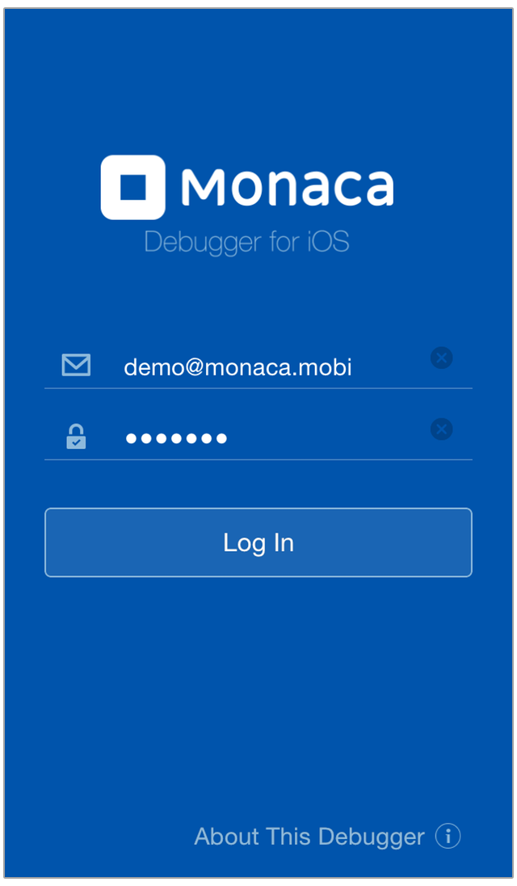

.. _debugger_on_ios:

================================================
Monaca Debugger for iOS
================================================

.. rst-class:: right-menu

  Monaca Debugger for iOS

.. rst-class:: clear

.. note:: If the Cordova version of your project is lower than 5.2, it might not work properly with Monaca Debugger 5.X.X. There are two ways to fix this issue:
      
  1. :ref:`upgrade Cordova version <changing_cordova_version>` of your project.
  2. use :ref:`custom built Monaca Debugger <custom_debugger_ios>`.

.. rst-class:: wide-table

  +---------------------------------+-------------------------------------------+-----------------------------------------------------------------------+
  | Debugger Type                   |         Monaca Debugger                   | Custom Built Monaca Debugger                                          |
  +=================================+===========================================+=======================================================================+
  | Installation                    | `App Store`__                             | Refer to :ref:`custom_debugger_ios`                                   |
  +---------------------------------+-------------------------------------------+-----------------------------------------------------------------------+
  | Description                     | Monaca Debugger available at the store.   | Monaca Debugger built from Monaca Cloud IDE.                          |
  +---------------------------------+-------------------------------------------+-----------------------------------------------------------------------+
  | :ref:`cordova_ios`              | Core and some third-party Cordova plugins | In addition to core and third-party Cordova plugins, user submitted   |
  |                                 | are automatically included.               | plugins (of the current project) are included.                        |
  +---------------------------------+-------------------------------------------+-----------------------------------------------------------------------+
  | App ID (iOS:CFBundleIdentifier) | ``mobi.monaca.debugger``                  | App ID set by user                                                    |
  +---------------------------------+-------------------------------------------+-----------------------------------------------------------------------+
  | Version Name                    | Fixed (currently 5.0.0)                   | Display version name set by user                                      |
  | (iOS:CFBundleShortVersionString)|                                           |                                                                       |
  +---------------------------------+-------------------------------------------+-----------------------------------------------------------------------+
  | App Version                     | Fixed (currently 5.0.0)                   | Version set by user                                                   |
  | (iOS:CFBundleVersion)           |                                           |                                                                       |
  +---------------------------------+-------------------------------------------+-----------------------------------------------------------------------+
  | :ref:`usb_ios`                  | Not Available                             | Available (Safari's Web Inspector)                                    |
  +---------------------------------+-------------------------------------------+-----------------------------------------------------------------------+
  | :ref:`localkit_ios`             | Not Available                             | Available                                                             |
  +---------------------------------+-------------------------------------------+-----------------------------------------------------------------------+
  | :ref:`network_ios`              | Not Available                             | Available                                                             |
  +---------------------------------+-------------------------------------------+-----------------------------------------------------------------------+
  

.. _AppStore: https://itunes.apple.com/en/app/monaca/id550941371?mt=8 
__ AppStore_

.. _cordova_ios:

Cordova Plugins
==============================

In Monaca Debugger, core and third-party Cordova plugins are automatically included. 

Monaca includes Core cordova plugins which are a minimal set of APIs such as Battery Status, Camera, Contacts, Device and so on. For a complete list of core Cordova plugins, please refer to :ref:`cordova_core_plugins`.

Monaca also includes some third-party Cordova plugins such as Statusbar, DatePicker, BarcodeScanner, Bluetooth and so on. For a complete list of currently included third-party Cordova plugins, please refer to :ref:`third_party_cordova_index`.

While developing your project, you may need to add other third-party or :ref:`custom <custom_cordova_plugin>` Cordova plugins to your project. The standard Monaca Debugger (Store Version) doesn't have these newly added plugins. For this reason, your project might not run properly in the debugger. Therefore, you need to use Custom Built Monaca Debugger. Custom Built Monaca Debugger is a debugger which is built from a Monaca Project within Monaca Cloud IDE. Please refer to :ref:`custom_debugger_ios`.

.. _usb_ios:

USB Debugging
==============================

Monaca Debugger for iOS supports USB debugging functions with Safari browser such as:

- console debugging: using console to diplay message.
- DOM inspection: viewing and modifying DOM structure with live updates.
- JavaScript debugging: profiling JavaScript performance, setting breakpoint and execution control.

For more information, please refer to :ref:`USB Debugging with Monaca Debugger for iOS Apps<usb_debugging_ios>`.

.. _localkit_ios:

Localkit Inspector Function
==============================

Inspector can be used when developing either on Windows or Mac OS.

.. _network_ios:

Network Install
==============================

Network Install is a feature provided by custom built Monaca Debugger for iOS allowing you to install the built app (debug build only) using the debugger. For more information, please refer to :ref:`how to use Network Install feature<debugger_project_options>`.

.. note:: This feature is not available for Monaca Debugger for iOS available at App Store.

.. _custom_debugger_ios:

How to Build Custom Built Monaca Debugger
====================================================

Preparation
^^^^^^^^^^^^^^^^^

You are required to have:

- a valid private key
- Developer certificate
- Development provisioning profile

Please refer to :ref:`building_for_ios` (Step 1 and Step 2) on how to get the above items and make necessary configurations before start building the custom debugger. After obtaining the above necessary files, start building with the following instruction:  

Start Building
^^^^^^^^^^^^^^^^^^^^^^^^^^^^^^^^^^

1. From Monaca Cloud IDE menu, go to :menuselection:`Debug --> Setup Monaca Debugger`.

2. Select :menuselection:`Debugger for iOS --> Build and Install`.

  .. figure:: images/debugger_ios/2.png   
    :width: 400px
    :align: left

  .. rst-class:: clear

3. Upload the development provisioning profile and click :guilabel:`Next` button.

4. This may take sometimes until your building is completed. The following screen will appear after the build is successfully completed. Then, you can download the built file to your PC and install it to your iOS device using iTune.

  .. figure:: images/debugger_ios/3.png   
    :width: 400px
    :align: left

  .. rst-class:: clear

5. After installing the debugger on your device, sign in with your Monaca account. Then, tick :guilabel:`I've installed Monaca Debugger and logged in` and click :guilabel:`Next`.

6. Monaca Cloud IDE will then try looking for the debugger. Once it's found and connected, click :guilabel:`Run on Device` to start running the current app in your debugger right away.

  .. figure:: images/debugger_ios/4.png   
    :width: 400px
    :align: left

  .. rst-class:: clear

7. By now your app should be running in your debugger. Try testing your app in the debugger and making some changes in the IDE. You will be able to see the changes reflected in the debugger once you save the changes. 

  .. figure:: images/debugger_ios/5.png   
    :width: 400px
    :align: left

  .. rst-class:: clear

.. seealso::

  *See Also*

  - :ref:`monaca_debugger_features`
  - :ref:`debugging_monaca_app`
