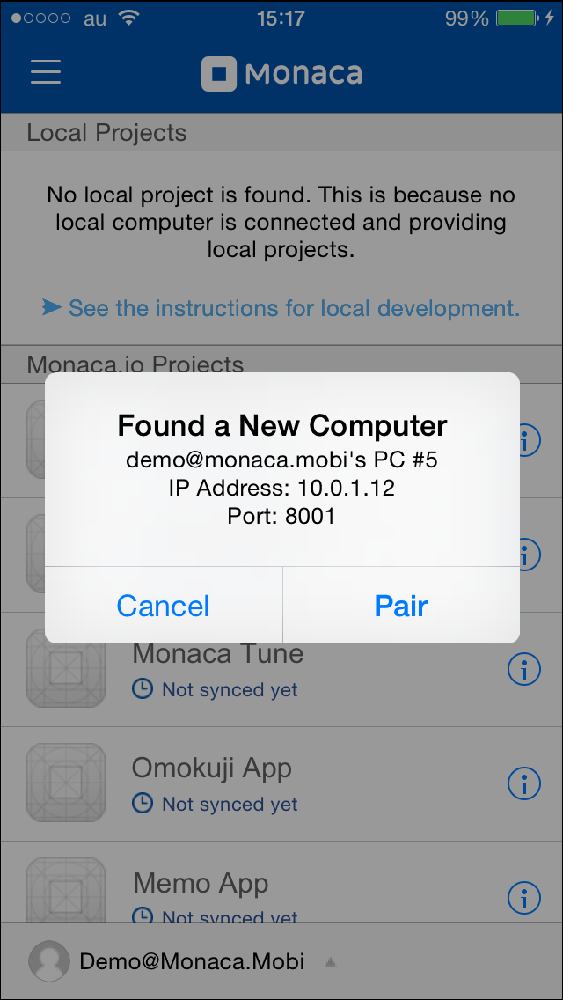
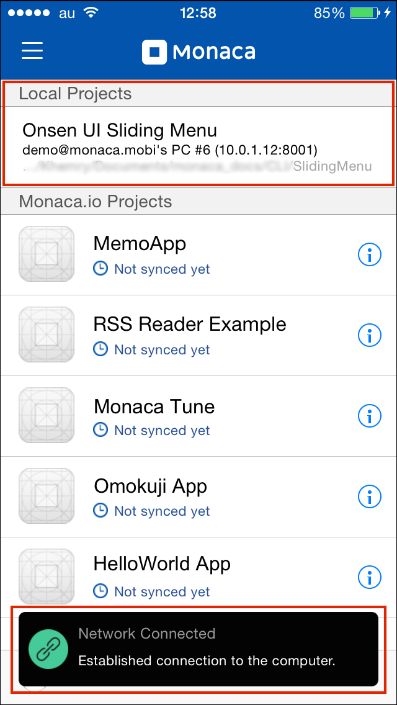
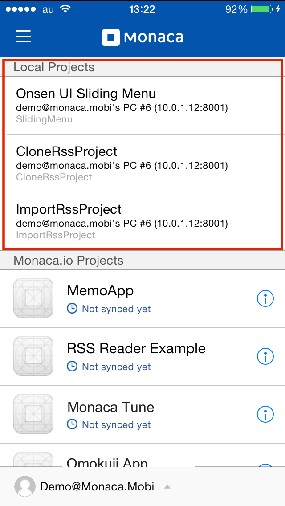
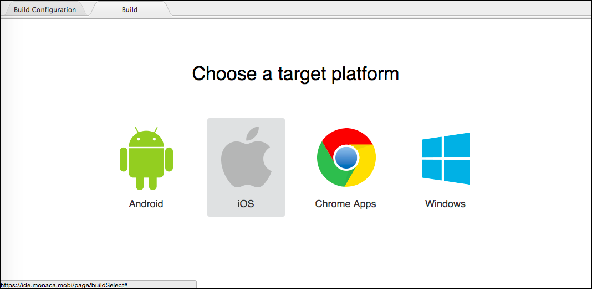
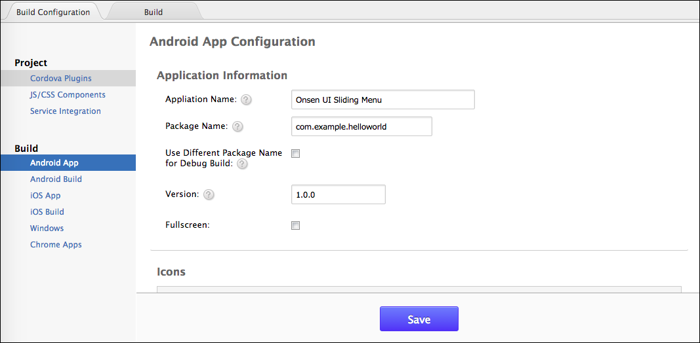

.. _monaca_cli_commands:

===============================
Monaca CLI Commands
===============================

.. rst-class:: right-menu

========================================= =======================================================================================
Commands                                   Description
========================================= =======================================================================================
:ref:`monaca_login`                        signs in to Monaca Cloud.
:ref:`monaca_create`                       creates a new Monaca project locally from a template.
:ref:`monaca_clone`                        clones a project from Monaca Cloud.
:ref:`monaca_import`                       imports a project from Monaca Cloud.
:ref:`monaca_upload`                       uploads a project to Monaca Cloud.
:ref:`monaca_download`                     downloads a project from Monaca Cloud.
:ref:`monaca_plugin`                       manages installed plugins of a project.
:ref:`monaca_debug`                        serves a single project to Monaca Debugger.
:ref:`monaca_preview`                      serves a single project to browser.
:ref:`monaca_multiserve`                   serves multiple projects to Monaca Debugger.
:ref:`monaca_remote_build`                 builds a project remotely on Monaca Cloud.
:ref:`monaca_proxy`                        configures proxy to use when connecting to Monaca Cloud.
:ref:`monaca_logout`                       signs out from Monaca Cloud.
========================================= =======================================================================================

.. _monaca_login:

.. rst-class:: function-reference

monaca login
^^^^^^^^^^^^^^^^^^^^^^^^^^^^^^^^^^^^^^^^^^^^^^^^^^^^^^^^^^^^^^^^^^^^^^^^^^^^^^

Signs in to the Monaca Cloud. You will be prompted to input your Monaca account information (username and password).

:dfn:`$ monaca login`

Example
  Here is an example when you login to Monaca Cloud with Monaca CLI:

  .. code-block:: bash

      $ monaca login
      Email address: demo@monaca.mobi
      Password: 
      Successfully signed in as demo@monaca.mobi.

.. rst-class:: function-reference

.. _monaca_create:

.. rst-class:: function-reference

monaca create
^^^^^^^^^^^^^^^^^^^^^^^^^^^^^^^

Creates a new Monaca project locally based on Monaca Cloud templates at a specified path. The command will show a list of available templates for the user to choose from. Then, the user need to input a number representing the preferred template.

:dfn:`$ monaca create path [name]`

Parameters
  =============== ============================================================================================================
  ``path``         location where you want to store your project files 
  ``name``         project name
  =============== ============================================================================================================

Example
  The following snippet shows how to create a new project based on a :ref:`onsen_ui_sliding_menu` template inside "Documents/CLI/MyProject" folder:

  .. code-block:: bash

      $ monaca create Documents/CLI/MyProject SlidingProject
      Which project template do you use?

      1: Hello World App
      2: Minimum Template
      3: RSS Reader Example
      4: Memo Application
      5: Break the Bricks
      6: Onsen UI Minimum Template
      7: Onsen UI Sliding Menu
      8: Onsen UI Tabbar
      9: Onsen UI Master-Detail
      10: Twitter Client
      11: Facebook Client
      12: Backend Memo
      13: Inmobi Client
      14: Flickr Sample
      15: TODO App
      16: Train Catalog
      17: Clock App
      18: BirthYear App
      19: Omikuji Fortune Telling App
      20: iBeacon
      21: NIFTY Cloud mobile backend
      22: Onsen UI Minimum Template for Universal App
      
      Type number>7
      Project created successfully.

.. rst-class:: function-reference

.. _monaca_clone:

.. rst-class:: function-reference

monaca clone
^^^^^^^^^^^^^^^^^^^^^^^^^^^^^^^^^^^^^^^^^^^^^^^^^^^^^^^^^^^^^^^^^^^^^^^^^^^^^^

Clones a project from Monaca Cloud. Firstly, it will display a list of all projects you have in Monaca Cloud. Then, you will need to input a number representing a project you want to clone into a specified directory on your local PC.

.. note:: If you clone a project into your local PC from Monaca Cloud, the cloned project keeps cloud synced information. In other words, if you make changes to this project locally and upload (using :ref:`monaca_upload`) them to Monaca Cloud, they will overwrite older files of the same project.

:dfn:`$ monaca clone`

Example
  Here is an exmaple of how to clone a project called RSS Reader Example from Monaca Cloud into "MyProjectFolder/CloneRssProject" folder on your local PC.

  .. code-block:: bash

      $ monaca clone
      Fetching project list...
      Please choose one of the following projects:

        1. RSS Reader Example
        2. HelloCordova
        3. Onsen UI Sliding Menu
        4. Hello World App
        5. Monaca Tunes

      Project number: 1
      Destination directory: MyProjectFolder/CloneRssProject

.. rst-class:: function-reference

.. _monaca_import:

.. rst-class:: function-reference

monaca import
^^^^^^^^^^^^^^^^^^^^^^^^^^^

Imports a project from Monaca Cloud. Firstly, it will display a list of all projects you have in Monaca Cloud. Then, you will need to input a number representing a project you want to import into a specified directory on your local PC.

.. note:: If you import a project into your local PC from Monaca Cloud, the imported project doesn't keep cloud synced information. In other words, if you make changes to this project locally and upload (using :ref:`monaca_upload`) them to Monaca Cloud, this project will be uploaded as a new project in Monaca Cloud.

:dfn:`$ monaca import`
  
Example
  Here is an exmaple of how to import a project called RSS Reader Example from Monaca Cloud into "MyProjectFolder/ImportRssProject" folder on your local PC.

  .. code-block:: bash

      $ monaca import
      Fetching project list...
      Please choose one of the following projects:

        1. RSS Reader Example
        2. HelloCordova
        3. Onsen UI Sliding Menu
        4. Hello World App
        5. Monaca Tunes

      Project number: 1
      Destination directory: MyProjectFolder/ImportRssProject

.. rst-class:: function-reference

.. _monaca_upload:

.. rst-class:: function-reference

monaca upload
^^^^^^^^^^^^^^^^^^^^^^^^^^^^^^^^^^^^^^^^^^^^^^^^^^^^^^^^^^^^^^^^^^^^^^^^^^^^^^

Uploads the current project to Monaca Cloud. The project files will be compared with the remote files so only the changed and new files will be uploaded.

.. note:: This command works differently for different types of projects:
          
          - new/imported project: this command will upload this whole project as a new project in Monaca Cloud.
          - cloned project: this command will overwrite the same project in Monaca Cloud.

:dfn:`$ monaca upload`

Options
  =========================================== ===========================================================================================================
  ``--delete``                                  deletes those files on Monaca cloud which are not existed locally.
  ``--force``                                   doesn't ask user for permission to continue.
  ``--dry-run``                                 simulates the upload operation and provides details of which files will be uploaded. 
                                                There is no actual upload operation is done. 
  =========================================== ===========================================================================================================

Example
  Navigate to your project folder. Then, type ``monaca upload`` command with various options and see how it works.

  .. code-block:: bash

      $ monaca upload --dry-run --delete
      Following files will be uploaded.
      1. /www/new_local_file.html

      Following files will be deleted on Monaca Cloud.
      1. /www/cloud_only_file.html      

      $ monaca upload --delete
      delete -> /www/cloud_only_file.html      
      [100%] /www/new_local_file.html
      Project successfully uploaded to Monaca Cloud!

.. rst-class:: function-reference

.. _monaca_download:

.. rst-class:: function-reference

monaca download
^^^^^^^^^^^^^^^^^^^^^^^^^^^^^^^^^^^^^^^^^^^^^^^^^^^^^^^^^^^^^^^^^^^^^^^^^^^^^^

Downloads updates/changes (of the synced project) made in Monaca Cloud. 

.. note:: This command will overwrite the changes into the local project. If your local project is not existed in Monaca Cloud, you can't use this command.

:dfn:`$ monaca download`

Options
  =========================================== ===========================================================================================================
  ``--delete``                                  deletes those files locally which are not existed on Monaca Cloud.
  ``--force``                                   doesn't ask user for permission to continue.
  ``--dry-run``                                 simulates the download operation and provides details of which files will be downloaded. 
                                                There is no actual download operation is done. 
  =========================================== ===========================================================================================================

Example
  Navigate to your project folder. Then, type ``monaca download`` command with various options and see how it works.

  .. code-block:: bash

      $ monaca upload --dry-run --delete
      Following files will be downloaded.
      1. /www/new_cloud_file.html

      Following files will be deleted locally.
      1. /www/local_file.html      

      $ monaca download --delete
      delete -> /www/local_file.html      
      [100%] /www/new_cloud_file.html
      Project successfully downloaded from Monaca Cloud!

.. rst-class:: function-reference

.. _monaca_plugin:

.. rst-class:: function-reference

monaca plugin
^^^^^^^^^^^^^^^^^^^^^^^^^^^^^^^^^^^^^^^^^^^^^^^^^^^^^^^^^^^^^^^^^^^^^^^^^^^^^^

Manages plugins of a project such as adding new plugins, listing and removing installed plugins.

:dfn:`$ monaca plugin [options]`
  
Options
  =========================================== ==============================================================================================
  ``add <plugin>``                              adds a plugin.
  ``rm <plugin>``                               removes a plugin.
  ``ls|list``                                   lists currently installed plugins.
  ``search <query>``                            searches the plugin directory.
  =========================================== ==============================================================================================

Example
  Navigate to your project folder and type the command below:

  .. code-block:: bash

      $ monaca plugin add org.apache.cordova.camera
      $ monaca plugin rm org.apache.cordova.camera
      $ monaca plugin search keyboard
      $ monaca plugin ls

.. rst-class:: function-reference

.. _monaca_preview:

.. rst-class:: function-reference

monaca preview
^^^^^^^^^^^^^^^^^^^^^^^^^^^^^^^^^^^^^^^^^^^^^^^^^^^^^^^^^^^^^^^^^^^^^^^^^^^^^^

Serves a single project to browser. Use this command when you want to run your project on the browser. 

:dfn:`$ monaca preview [option]`

.. rst-class:: function-reference

.. _monaca_debug:

.. rst-class:: function-reference

monaca debug
^^^^^^^^^^^^^^^^^^^^^^^^^^^^^^^^^^^^^^^^^^^^^^^^^^^^^^^^^^^^^^^^^^^^^^^^^^^^^^

Serves a single project to Monaca Debugger. Use this command when you want to debug your project on a device (Monaca Debugger). It will reflect the changes instantly. This command starts a web server for the Monaca Debugger to connect to. It also starts broadcasting messages to tell debuggers in the local network to connect to it. When a debugger has connected, all file changes will be sent to it.

:dfn:`$ monaca debug [option]`

Options:
  =========================================== ==============================================================================================
    ``--port``                                  HTTP port to listen to (default value is 8001)
  =========================================== ==============================================================================================

Example
  Navigate to your project folder and use ``monaca debug`` command. Then, you should be able to see that project name in Monaca Debugger under *Local Projects* section. Click on that project in order to run it. Please try to make some changes to the project and save them. You should be able to see those changes reflect instantly.

  .. code-block:: bash

      $ cd MyProjectFolder/ImportRssProject
      $ monaca debug

.. note:: In order to stop ``monaca debug`` process, press :guilabel:`Ctrl+c`.

.. note:: When runnig this command, you should be prompted to pair your debugger with your local PC or see the notification of successful network connection (see the screenshots). Otherwise, please refer to :ref:`troubleshoot_pair`.
     

  Pairing Dialog  
  

      
  Network Connection Notification
  
.. rst-class:: clear

.. rst-class:: function-reference

.. _monaca_multiserve:

.. rst-class:: function-reference

monaca multiserve
^^^^^^^^^^^^^^^^^^^^^^^^^^^^^^^^^^^^^^^^^^^^^^^^^^^^^^^^^^^^^^^^^^^^^^^^^^^^^^

Serves multiple projects to Monaca Debugger. It works in the same way as :ref:`monaca_debug` except it can serve a list of project at once to Monaca Debugger (see the screenshot below). Therefore, successful pairing/connection between your debugger and local PC is required. Otherwise, please refer to :ref:`troubleshoot_pair`.

.. rst-class:: clear

:dfn:`$ monaca multiserve paths`

Parameters:
  =========================================== ==============================================================================================
    ``paths``                                    a list of project directories 
  =========================================== ==============================================================================================

Example
  Try to use this command with a list of projects you have on your local PC. In this example, we are serving 3 projects (SlidingMenu, ImportRssProject and CloneRssProject) which are under "MyProjectFolder/" to Monaca Debugger. You should see a list of these projects in your debugger if the pairing is successful.

  .. code-block:: bash
      
      $ cd MyProjectFolder/
      $ monaca multiserve SlidingMenu ImportRssProject CloneRssProject

.. note:: In order to stop ``monaca multiserve`` process, press :guilabel:`Ctrl+c`.

.. rst-class:: function-reference

.. _monaca_remote_build:

.. rst-class:: function-reference

monaca remote build
^^^^^^^^^^^^^^^^^^^^^^^^^^^^^^^^^^^^^^^^^^^^^^^^^^^^^^^^^^^^^^^^^^^^^^^^^^^^^^

Builds the project on Monaca Cloud. If your project is not existed in Monaca Cloud yet, it will be automatically uploaded to the cloud first before the build starts. However, if your project is alreayd existed in Monaca Cloud, all its local updates/changes will be uploaded to the cloud first before the build starts. 

Please refer to :ref:`build_index` for more information on how to:

- config build settings for each platform
- types of build
- build the application for each platform
- get/install the built apps. 

:dfn:`$ monaca remote build [options]`

Options:
  =========================================== ==============================================================================================
    ``--platform``                              builds for specific platform. It can be: ``ios``, ``android`` or ``windows``.
    ``--build-type``                            chooses the build type. It can be: 

                                                  - ``debug`` (for iOS, Android and Windows. It is default option.)
                                                  - ``test`` (for iOS only)
                                                  - ``release`` (for iOS, Android and Chrome Apps)

    ``--android_webview``                       if the platform is ``android``. It can be: ``default`` or ``crosswalk``.
    ``--android_arch``                          required if ``--android_webview`` is ``crosswalk``. It can be: ``x86`` or ``arm``.
  =========================================== ==============================================================================================

Example
  Navigate to your project folder and try to use this command with different options:

  .. code-block:: bash

      $ monaca remote build 
      $ monaca remote build --platform=ios --build-type=test
      $ monaca remote build --platform=android --build-type=debug --android_webview=crosswalk --android_arch=arm

.. note:: If you use ``monaca remote build`` command without any options, you will get an interactive build interface in your browser. In this page, you can config build settings and choose specific platform you want to build for (see the screenshots below). 

.. rst-class:: function-reference

.. _monaca_proxy:

.. rst-class:: function-reference

monaca proxy
^^^^^^^^^^^^^^^^^^^^^^^^^^^^^^^^^^^^^^^^^^^^^^^^^^^^^^^^^^^^^^^^^^^^^^^^^^^^^^

Configures proxy to use when connecting to Monaca Cloud. 

:dfn:`$ monaca proxy <command>`

Parameters
  =========================================== ==============================================================================================
    ``set <URL:PORT_NUMBER>``                  sets a proxy server.
    ``rm``                                     removes a proxy server.
  =========================================== ==============================================================================================

Example
  Navigate to your project folder and type the command below:

  .. code-block:: bash

      $ monaca proxy set http://my.proxy.com:8080
      $ monaca proxy rm

.. rst-class:: function-reference

.. _monaca_logout:

.. rst-class:: function-reference

monaca logout
^^^^^^^^^^^^^^^^^^^^^^^^^^^^^^^^^^^^^^^^^^^^^^^^^^^^^^^^^^^^^^^^^^^^^^^^^^^^^^

Signs out from Monaca Cloud and removes stored login token.

:dfn:`$ monaca logout`

Example
  Here is an example when you logout from Monaca Cloud with Monaca CLI:

  .. code-block:: bash

      $ monaca logout
      Signing out from Monaca Cloud...
      You have been signed out.
      Removed Monaca Debugger pairing information.

