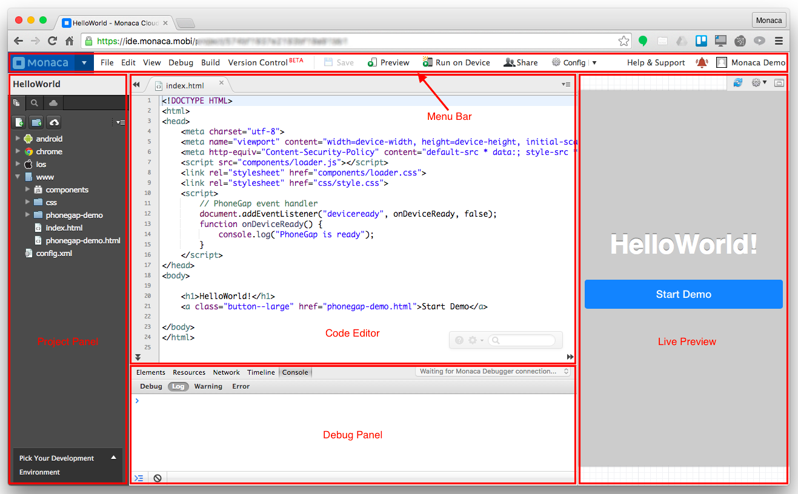
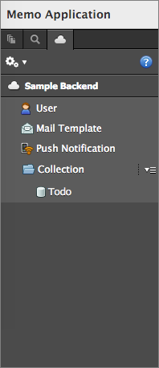
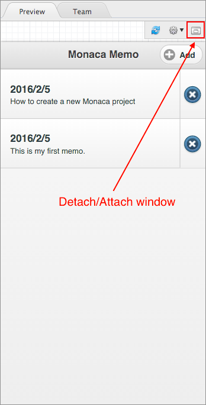

================================================
Cloud IDE Overview
================================================

.. rst-class:: right-menu

Monaca Cloud IDE consists of 5 main parts such as:

1. :ref:`menu_bar`
2. :ref:`file_tree`
3. :ref:`debug_panel`
4. :ref:`preview_team_panel`
5. :ref:`code_editor`

.. rst-class:: clear

.. _menu_bar:

Menu Bar
===================

.. rst-class:: clear

In the menu bar, there are several main menus such as:

.. list-table::
   :widths: 10 30

   * - :ref:`file`
     - Opens :guilabel:`File` submenu. 
   * - :ref:`edit`
     - Opens :guilabel:`Edit` submenu. 
   * - :ref:`view`
     - Opens :guilabel:`View` submenu. 
   * - :ref:`debugger`
     - Opena :guilabel:`Debug` submenu. 
   * - :ref:`build`
     - Opens :guilabel:`Build` submenu. 
   * - Save
     - Saves the file currently openeded. If no file is opened, this function is disable.
   * - Preview
     - Displays the Preview window.   
   * - Run on Device
     - Runs the current project in Monaca Debugger.
   * - Team
     - Displays the Team Management panel. 
   * - :ref:`config`
     - Opens :guilabel:`Config` submenu. 

.. _file:

File
^^^^^^^^^

.. list-table::
   :widths: 10 30

   * - New File...
     - Creates a new file. 
   * - New Folder...
     - Creates a new folder. 
   * - Save
     - Saves the file currently openeded.
   * - Save All
     - Saves all the files currently openeded.
   * - Upload
     - Uploads the files in the current folder. 
   * - Delete
     - Deletes the currently selected file/folder. 
   * - Rename
     - Renames the currently selected file/folder. 
   * - Copy File
     - Makes a copy of the currently selected file. 
   * - View Older Version...
     - Views older versions of the currently selected file. 
   * - Export...
     - Exports Monaca project. 
   * - Editor Configuration...
     - Configures the appearance of the editor. 
   * - Manage JS/CSS Components...
     - Adds/Removes JavaScript and CSS libraries to/from the current project. 
   * - Manage Cordova Plugins...
     - Enables/Disables Cordova plugins in the current project. 

.. _edit:

Edit
^^^^^^^^^

.. list-table::
   :widths: 10 30

   * - Undo
     - Undoes the latest action. 
   * - Redo
     - Redoes the previous action.
   * - Search
     - Searches for a string in the currently opened file.
   * - Search Next
     - Goes to the next found string. 
   * - Search Previous
     - Goes to the previously found string.
   * - Replace...
     - Replaces a found string in the currently opened file. 
   * - Replace All
     - Replaces all the found strings in the currently opened file.
   * - Comment Out
     - Comments out the current line. 
   * - Comment In
     - Uncomments the current line. 

.. _view:

View
^^^^^^^^^

.. list-table::
   :widths: 10 30

   * - Project Tree
     - Shows/Hides the project tree. 
   * - Maximize Editor
     - Switches the ON/OFF of the editor maximization. 
   * - Grep
     - Searches for files by using Unix command.
   * - Backend
     - Goes Monaca Backend settings page. 

.. _debugger:

Debug
^^^^^^^^^^^^^

.. list-table::
   :widths: 10 30

   * - Preview
     - Opens Preview window.
   * - Run on Device
     - Runs the project on Monaca Debugger.
   * - Setup Monaca Debugger
     - Installs the Monaca Debugger on your device. 

.. _build:

Build
^^^^^^^^^

.. list-table::
   :widths: 10 30

   * - Build App for Android       
     - Builds the app for Android device. 
   * - Build App for iOS              
     - Builds the app for iOS device. 
   * - Build App for Windows
     - Builds the app for Windows device.
   * - Build App for Chrome Apps          
     - Builds the app for Chrome. 

.. _config:

Config
^^^^^^^^^

.. list-table::
   :widths: 10 30

   
   * - Android App Settings...
     - Configures Android app's information (see :ref:`building_for_android`). 
   * - Android Key Store Settings...
     - Configures Android's keystore (see :ref:`building_for_android`). 
   * - iOS App Settings...
     - Configures iOS App's information (see :ref:`building_for_ios`). 
   * - iOS Build Settings...
     - Configures iOS build settings (see :ref:`building_for_ios`).        
   * - Windows App Settings...
     - Configures necessary information to build a Windows app (see :ref:`building_for_win8`). 
   * - Chrome App Settings...
     - Configures necessary information to build a Chrome app (see :ref:`building_for_chrome_app`). 
   * - Manage Cordova Plugins...
     - Enables/Disables Cordova plugins in the current project (see :ref:`cordova_plugins_setting`). 
   * - Manage JS/CSS Components...
     - Adds/Removes JavaScript and CSS libraries to/from the current project (see :ref:`js_css`). 
   * - Service Integration...
     - Integrates various services to Monaca projects in the form of plugins (see :ref:`service_integration_index`).
   * - Editor Configuration
     - Configures the appearance of code editor (see :ref:`editor_functions`).
   

.. _file_tree:

Project Panel
===================

In the Project panel, there are 3 main tabs:

* *File Tree*: Displays a list of folders and files existed in the current project. Right-click on a folder or file to see additional functions such as New File, Copy, Rename, Delete, Upload File and so on. To edit a file, select it and then its content will be shown in :ref:`Monaca IDE Editor<code_editor>`.
* *Grep*: Searches for files by using Unix command.
* *Monaca Backend*: Contains the backend settings of the project.

   
   File Tree

   
   Grep

   
   Monaca Backend

.. rst-class:: clear

.. _debug_panel:

Debug Panel
===================

Once Monaca Debugger is connected with Monaca Cloud IDE, you can do console debugging as well DOM inspection in this panel. For more information, please refer to :ref:`by_debugger_ide`.

.. rst-class:: clear

.. _preview_team_panel:

Preview & Team Panel
==================================

.. _preview_tab:

Live Preview
^^^^^^^^^^^^^^^^^

The Live Preview provides an overview of your app in real-time. You can also interact with this preview as if it is running on an actual device with the limitation of executing the specific device’s functionality (such as camera, contact and so on) and cross-origin network AJAX request. Along with the Monaca Debugger, you will have effective and efficient experiences during app development. 

In this tab, you can:

- refresh the Preview window.

- change the display device's screen by clicking on the :guilabel:`Configure` icon in that tab. Then, you will see a drop-down list of different devices such as iPad, iPhone, Galaxy, Nexus and so on. You can change the orientation of the screen as well.

- detach/attach the Preview window.

.. rst-class:: clear

*Live Preivew Limitations*

When using Live Preview, you should be aware of the the following limitations:

- Cordova Plugin APIs are not available.
- Ajax requests will fail because of Cross-origin restriction. However, it can be done if server-side scripts return "Access-Control-Allow-Origin” Header (i.e., Cross-Origin Ajax Request is permitted).
- Viewport appearance may differ from real devices.
- Monaca Backend API and Push Notifications can not be initialized.

.. _team_tab:

Team Management
^^^^^^^^^^^^^^^^^^^^^^

.. note:: The usability of this function depends on your Monaca subscription plan. For more information, please refer to `Monaca Subscription Plan <https://monaca.mobi/en/pricing>`_.

Team Management allows you to:

- manage the team: add/remove members to the shared project.

- share the source code with multiple people (members are assigned as Developers). There are 3 ways to do this such as:

  1. The easiest way is to use Monaca Cloud's Team Management function. Then, two or more people can open the same project in different Monaca Cloud IDEs. However, if there is any conflict while updating the project, the previous version of the project will be overwritten (but it still remains in the file history). 

  2. Another way is to set up a version control system and do the local development using :ref:`Monaca Localkit <monaca_localkit_index>` or :ref:`Monaca CLI <monaca_cli_index>`. This requires a higher skill set, but more collaborative.

  3. The last option is to use :ref:`Monaca for Visual Studio <monaca_vs_index>`. In this case, files can be managed by Visual Studio's built-in Team Explorer function. Git, TFS, Visual Studio Online and other supported version control system can be used in this case.

- let multiple people to test the project (members are assigned as Testers). 

.. note:: If your Monaca subscription plan is Basic or Personal, you can only chat and join a team as a Tester.

*Manage Member*

You can share your project with other Monaca users. You can also add/remove other Monaca users to/from your project. In order to manage the members of your project, please do as follows:

1. Click on :guilabel:`Add/Manage Members` button in the Team tab.

  .. figure:: images/overview/8.png
      :width: 300px
      :align: left

  .. rst-class:: clear

2. Then, the Team Member Manage screen will appear. To add a member, input the email(s) of your team member(s). Please enter one email address per line. You can also assign the role of each member as Developer or Tester by choosing from the drop-down menu. Then, click :guilabel:`Add Member` button to send the invitation to them.

  .. figure:: images/overview/9.png
      :width: 500px
      :align: left

  .. rst-class:: clear

3. To remove a member from the project, you can just click on the :guilabel:`delete` icon at the end of the row of that member's info as shown below

  .. figure:: images/overview/10.png
      :width: 500px
      :align: left

  .. rst-class:: clear

*Chat*

You can send messages, screenshots and files with your team members through chat. The conversation can be made from within Monaca Cloud IDE and Monaca Debugger.

  .. figure:: images/overview/11.png
      :width: 300px
      :align: center

  .. rst-class:: clear

.. _code_editor:

Code Editor
===================

Views and edits the selected file from the file tree. Various settings such as Preferences is also shown and can be edited here. Once you open a file, you can select it from the tab. 

The editor supports the syntax highlight of JavaScript/HTML5/CSS3. The editor also supports JavaScript and CSS autocomplete function, :ref:`Emmet (Zen Coding) <emmet>` and :ref:`typescript_manual`. 

.. note:: Please refer to :doc:`editor` for the list of all shortcuts available in Monaca code editor. 

.. figure:: images/overview/12.png
    :width: 500px
    :align: center

.. rst-class:: clear

Inside this editor, there is also a small and short menu bar as shown below:

.. rst-class:: clear

Within this short menu, you can:

- go to Monaca documentation by clicking on :guilabel:`Help` icon.
- config the code editor by clicking on :guilabel:`Setting` icon. You will see 3 menu items such as:

  1. View Older Versions: View older versions of the currently selected file. 
  2. Editor Configuration: Configure the appearance of the editor. 
  3. Editor Shortcuts: open the keyboard shortcut references.

- search for a string inside the currently opened file.

