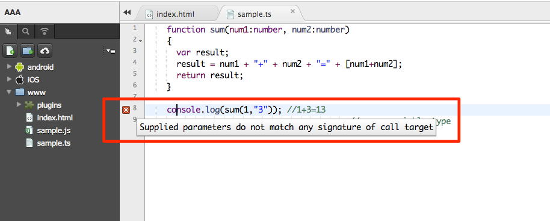

.. _typescript_manual:

================================================
TypeScript
================================================

.. rst-class:: right-menu

What is TypeScript?
========================

`TypeScript <http://www.typescriptlang.org/>`_  , developed by Microsoft, is a free and open source programming language. It is a typed superset for JavaScript that compiles into plain JavaScript. TypeScript focuses on providing useful tools for large scale applications by implementing features such as:

- :ref:`annotation`
- :ref:`interface`
- :ref:`arrow`
- :ref:`modifier`
- :ref:`inheritance`

.. note:: In Monaca, Code Suggestion does not support TypeScript.

:file:`.ts` is the extension of TypeScript files. In Monaca, the TypeScript file is automatically compiled and creates its JavaScript version after it is saved. For example, let's create a TypeScript file in Monaca Cloud IDE under ``www`` folder and name it as :file:`test.ts` with the following content.

.. code-block:: javascript

    document.body.innerHTML = "Hello World!"; 
  
After saving this file, you can see that the :file:`test.js` file is created. You will be able to find it in the project tree with the same level of :file:`test.ts`. 

.. warning:: The TypeScript compiler is running when you save a TypeScript file. This compiler will overwrite the JavaScript file without any prompt. Please be careful not to edit the JavaScript file directly.

.. warning:: When you save .ts file, please close .js file that will be generated. If you save main.ts file with main.js file open, main.js file will not be refreshed. 

.. _annotation:

Type Annotations
========================

Type Annotations enable us to check and express our intent in the programs we write during compile time. In other words, Type Annotations are expressed as part of the function parameters; they indicate what types of values you can pass to the function. For large-scale applications, this feature is extremely helpful since we are able to pin point the compile-time error.

To demonstrate this feature, let's create a function as below inside the :file:`test.ts` file. In the below code the ``num1`` and ``num2`` parameters are designated as numeric values. 

.. code-block:: javascript

    function sum(num1:number, num2:number)
    {
      var result;
      result = num1 + "+" + num2 + "=" + [num1+num2];
      return result;
    }

    console.log (sum(1,3)); //1+3=4
  
Then, call the :file:`test.js` in the :file:`index.html` as follow:

::

  <body>
    ...
    
    ...
  </body>

.. warning:: Please do not specify TypeScript file as a src attribute in HTML file. Please load as JavaScript file compiled from ".ts file" as above.

Afer running the app, the result will be displayed correctly in the :file:`index.html` file since there are no errors found. Now, let's intentionally create an error while calling the ``sum`` function in the :file:`test.ts` file. Please change its content as follows:

.. code-block:: javascript

    function sum(num1:number, num2:number)
    {
      var result;
      result = num1 + "+" + num2 + "=" + [num1+num2];
      return result;
    }

    console.log(sum(1,"3")); //wrong variable type

When you save :file:`test.ts` with this error, a notification icon of that error is shown on the left side of the editor at the line containing the error. Mouse-over that notification icon to see the error message. In this case, the error message is:

.. rst-class:: clear

::

  Supplied parameters do not match any signature of call target

Please note that despite the error, the :file:`test.js` is still created and the app is running normally but giving the wrong result.

.. _interface:

Interfaces
========================

With TypeScript, not only that we can declare an interface, but we can also use it as a type annotation. In the following example, we create a simple interface which is used as an object type. Replace the following code into :file:`test.ts` file.

.. code-block:: javascript

  interface People 
  {
     name: string;
     age: number;
  }
   
  function info(people : People) {
     var result = people.name + " is " + people.age + " years old.";
     return result;
  }

  console.log(info({name:"Monaca", age: 30}));
  
After saving it, there are no errors found. Let's make an error by calling the ``info`` with just one parameter as below:

.. code-block:: javascript

  interface People 
  {
     name: string;
     age: number;
  }
   
  function info(people : People) {
     var result = people.name + " is " + people.age + " years old.";
     return result;
  }

  console.log( info({age: 30}) );

When you save :file:`test.ts` with this error, a notification icon of that error is shown on the left side of the editor at the line containing the error. Mouse-over that notification icon to see the error message. In this case, the error message is:

::

  Supplied parameters do not match any signature of call target:
  Could not apply type 'People' to argument 1, which is of type '{ age: number; }'

Please note that despite the error, the :file:`test.js` is still created and the app is running normally but giving the wrong result.

.. _arrow:

Arrow Function Expressions
====================================

Arrow Function Expressions are compact ways of defining JavaScript functions. Especially, Arrow Function Expressions help you handle the scope of the ``this`` keyword.please see the code example below.

.. code-block:: javascript

  var people = 
  {
    name: "Mr.Monaca",
    age: 30,
    popup: function() 
    {
      setTimeout(function()
      {
        console.log('This inside setTimeout(): ' + this.name);
      }, 3000);
    }
  };
  people.popup();

Then, save it and run the application. Let's observe the output. We can see that the value of ``this.name`` is empty. In order to handle the value of ``this`` keyword, use arrow function  ``=>`` . Therefore, please replace ``function()`` in the ``setTimeout`` function by the arrow function as follow:

.. code-block:: javascript

  var people = 
  {
    name: "Mr.Monaca",
    age: 30,
    popup: function() 
    {
      setTimeout(() => // we replace "function(){}" by "()=>{}"
      {
        console.log('This inside setTimeout(): ' + this.name); 
      }, 3000);
    }
  };
  people.popup();

Now, save it and run the application again. This time the value of ``this.name`` is displayed correctly.

.. _modifier:

Access Modifiers
============================

TypeScript also supports classes and their access modifiers. With TypeScript, it is easier for you to control access to Members and Classes in JavaScript. Please pay attention to the accessibility of the class properties in the code below.

.. code-block:: javascript

  class Customer {
  
    public userName = "Monaca";
    private secretID = 123;
  }

  var user1 = new Customer();

  console.log(user1.userName);// no error => Monaca
  console.log(user1.secretID);// error found => could not access user1.secretID!

  

As we could see, the last line of code is the source of the error since it tried to access the ``secretID`` which is the private variable of the ``Customer`` Class. In this case, the error message is:

.. rst-class:: clear

::

  The property 'firstName' does not exist on value of type 'People'

Now, let's try using the access modifier to those variables as shown below and observe the differences. 

.. code-block:: javascript

  class Customer {
  
    public userName = "Monaca";
    public secretID = 123;
  }

  var user1 = new Customer();

  console.log(user1.userName);// no error => Monaca
  console.log(user1.secretID);// no error => 123

.. _inheritance:

Inheritance
========================

You can also extend an existing class and create a derived class from it by using ``extends`` keyword. The following example shows how to use this keyword.

.. code-block:: javascript

  class People 
  {
    name: string;
    age: number;

    constructor(name:string, age: number)
    {
      this.name = name;
      this.age = age;
    }

    info() 
    {
      return this.name + "-" + this.age;
    }
  }  

  class Customer extends People
  {
    userName: string;
    secretID: number;

    constructor(name: string, age:number, userName:string, secretID:number)
    {
      super(name, age); // call the constructor of the People class
      this.userName = userName;
      this.secretID = secretID;
    }

    info()  // override the info() class  
    {
      return this.userName + "-" + this.secretID;
    }

    peopleInfo()
    {
      return super.peopleInfo();  //call info() of the People class
    }
  }

  var user1 = new Customer("Mr.Monaca", 30, "Monaca", 123);
  console.log(user1.customerInfo());
  console.log(user1.peopleInfo());

Let's analyze the above code. There are 3 main things happening up there:

- ``Customer`` class automatically has ``name`` and ``age`` properties since it is derived from ``People`` class.
- The ``super`` method used in the constructor method of ``Customer`` class is used to call the constructor method of ``People`` class.
- ``info()`` method in ``Customer`` class overrides the base (``People``) class's implementation while ``peopleInfo()`` method directly calls the ``info()`` method of the base class.

.. seealso::

  *See Also*
  
  - :ref:`editor_functions`
  - :ref:`code_editor`
