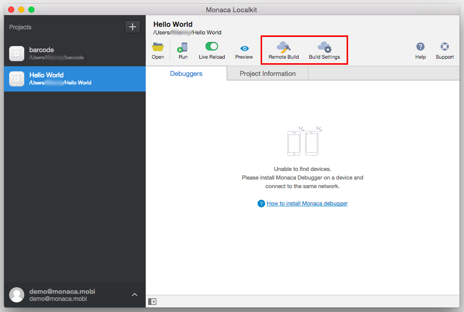

.. _localkit_build_publish:

================================================
Remote Building and Publishing
================================================

.. rst-class:: right-menu

Remote Building
==========================

Inside :guilabel:`Remote Build`, there are several important functions such as:

- Building application: choose a specific platform (among Android, iOS, Chrome Apps and Windows) to build.
- Building configuration: configure necessary information regarding application and build for each platform.
- Project dependencies: include necessary dependencies (:ref:`Cordova plugins<standard_plugins>`, :ref:`js_css` and Service Integration) used by the project.

Until this step, we assume that you have successfully developed a complete application. Then, you can try building your app and installing it on your device. Once the app development and testing are completed, your app is ready for market submission. Before releasing or distributing your app into the markets (App Store, Google Play, ...), you will need to create a release build of your app. 

Please refer to the following documentation on how to build your app according to each platform:

- :doc:`../../build/ios/index`
- :doc:`../../build/build_android`
- :doc:`../../build/build_winrt`
- :doc:`../../build/build_chrome_app`.

Publishing
==================================

Publishing for App Store
^^^^^^^^^^^^^^^^^^^^^^^^^^^^^^

Please refer to :ref:`app_store_distribution`.

Publishing for Google Play
^^^^^^^^^^^^^^^^^^^^^^^^^^^^^^

Please refer to :ref:`google_play_distribution`.

For more information regarding the distribution of Monaca Apps for other platforms, please refer to :ref:`distribution_index`.

.. seealso::

  *See Also*

  - :doc:`../../../quick_start/localkit/index`
  - :doc:`overview`
  - :doc:`pairing_debugging`
  - :doc:`troubleshooting`
