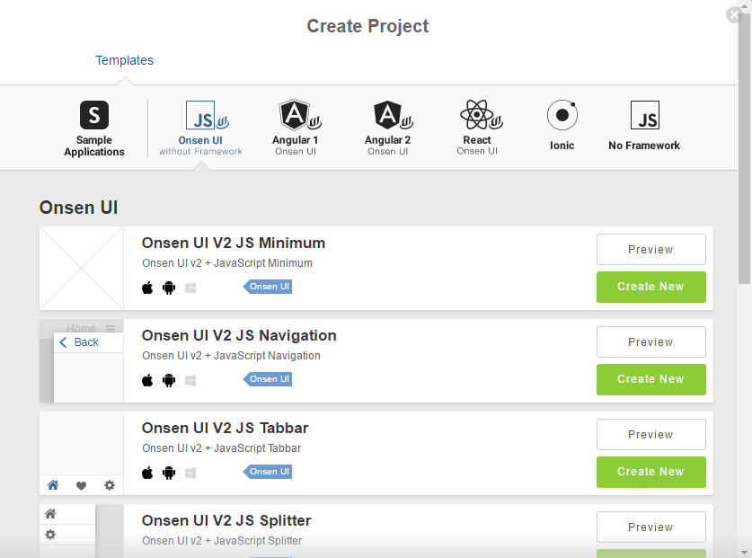

Onsen UI
========================

.. container:: twocol

   .. container:: leftside

      .. figure:: images/with_text.png
         :scale: 50 %
         :align: center
      
      HTML5 Framework for Building Mobile App Front End

   .. container:: rightside

      .. compound::
         **Onsen UI** is a front-end development tool that radically improves PhoneGap/Cordova apps. 
         Differing from previous frameworks, it is highly flexible and gives hybrid apps a native 
         look and feel on all platforms. And when used with Monaca, it is simple to add backend 
         features and device support, resulting in a publishable app. 
         
         For more information on **Onsen UI**, please go to `Onsen UI home page <http://onsenui.io>`_.
      
Starting a new Onsen UI project in Monaca
---------------------------------------------------

Go to Dashboard
~~~~~~~~~~~~~~~~~~~~~~~~~~

Go to Dashboard and click *New Project*

.. image:: images/new_project.png
  :width: 350px

Choose one Onsen UI template that best fit your project type
~~~~~~~~~~~~~~~~~~~~~~~~~~~~~~~~~~~~~~~~~~~~~~~~~~~~~~~~~~~~~~~~~~~~~~

  
Where to go from here
~~~~~~~~~~~~~~~~~~~~~~~~~~~~~~~~~~~~

Now you have Onsen UI installed. See examples in `Onsen UI Docs <http://onsenui.io/guide/overview.html>`_  for how to use Onsen UI components.
