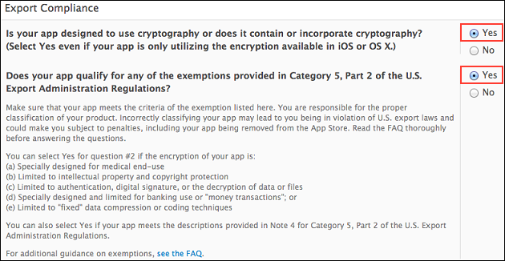

.. _encryption_6_2_plugin:

----------------------------------------------------------
New Encryption Plugin
----------------------------------------------------------

This plugin provides the encryption function for HTML5 assets bundled up with the built app in Monaca and the decoding function for application execution time.

.. note:: This plugin is available to Enterprise users only.

  
Supported Platforms
=========================

- Cordova 4.1 or later
- iOS 7 or later
- Android 4.0 or later

Encryption Scheme
=======================

====================================== =======================================================================
Encryption Method                        AES
Key Length                               256bit
====================================== =======================================================================

Enable the Plugin in Monaca
==============================

1. From Monaca Cloud IDE menu, go to :menuselection:`File --> Manage Cordova Plugins` or :menuselection:`Config --> Manage Cordova Plugins`.

2. Click :guilabel:`Enable` button of ``Encrypt`` to add it into your project.

  .. image:: images/html5_resource_encryption/1.png  
         :width: 700px

3. Next, you need to setup the encryption password. Find your newly added plugin under the *Enable Plugins* section. Then, hover the plugin and click :guilabel:`Config` button.

  .. image:: images/html5_resource_encryption/2.png
      :width: 700px

4. Enter the password for this encryption. Then, click :guilabel:`OK` button.

  .. image:: images/html5_resource_encryption/3.png
      :width: 400px

App Store Submission
========================

In this plugin, we use the encryption library of iOS SDK. Therefore, in order to release the built app embedded this plugin to the AppStore, you need to set 2 options when you submit your app for a review. Under the Export Compliance section, please choose "Yes" for both questions as shown in the screenshot below:

.. seealso::

  *See Also*

  - :ref:`third_party_cordova_index`
  - :ref:`cordova_core_plugins`