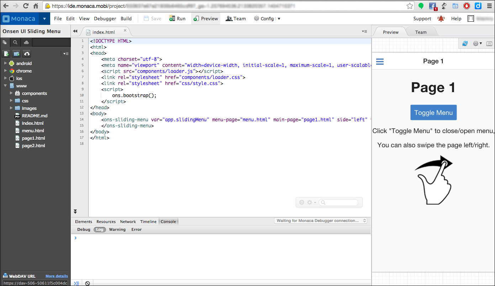
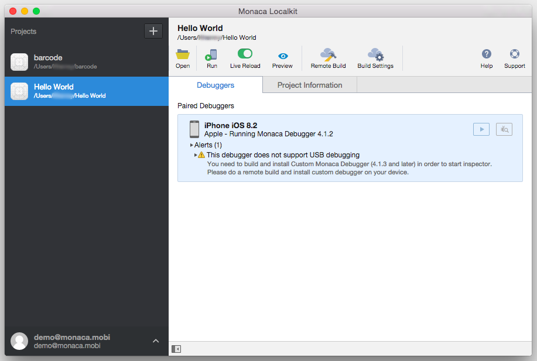
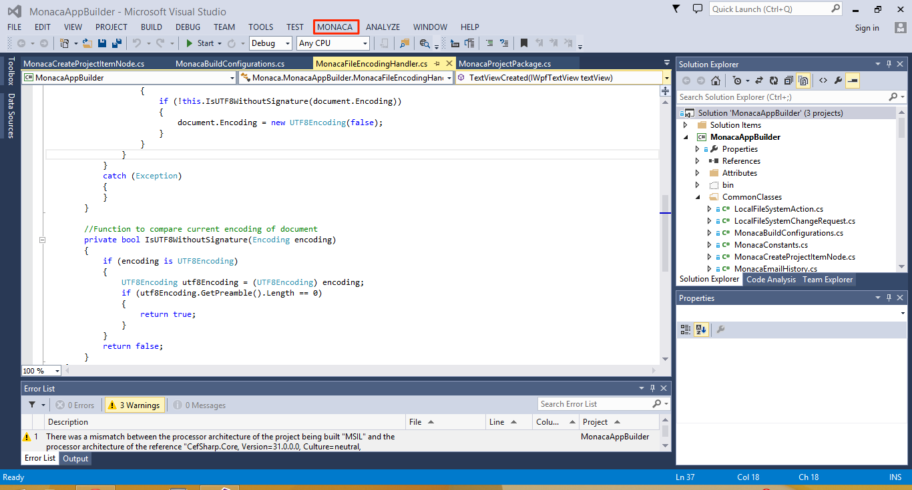
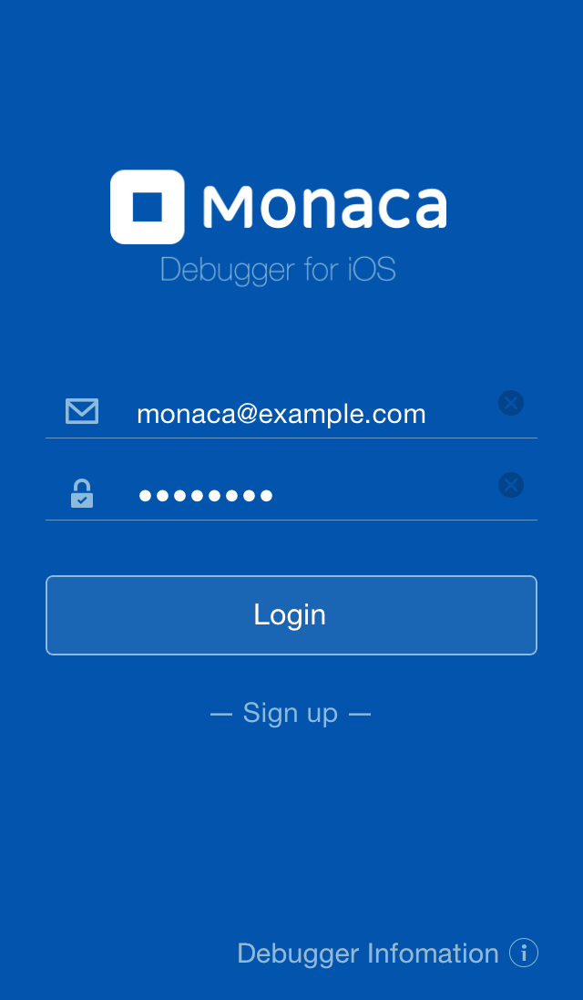
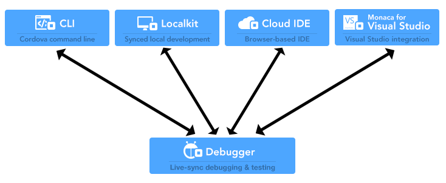
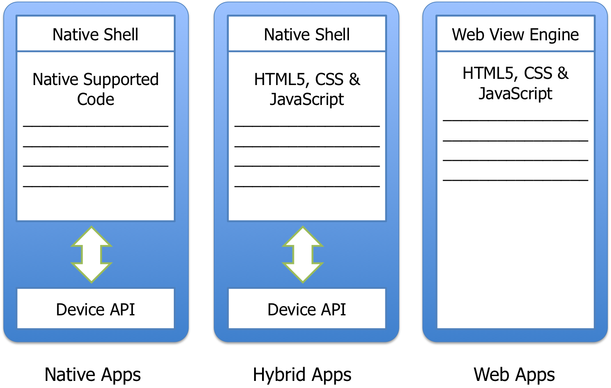

.. _monaca_intro:

========================================================================
Monaca Development Overview
========================================================================

.. rst-class:: right-menu

.. _what_is_monaca:

What is Monaca?
========================

Monaca is a development environment for smartphone and tablet applications provided by Asial Corporation. Monaca does not only provide you with a development environment at your fingertips, but also allows anyone to be able to develop smartphone applications easier.

Monaca uses :ref:`hybrid <feature_hybrid_app>` approach to deliver mobile apps. It makes :ref:`hybrid mobile app <feature_hybrid_app>` development process with PhoneGap/Cordova simpler and stress-free with our comprehensive cloud-powered app development tools and services. Monaca is framework-agnostic and adaptive, ready to be immediately plugged into your existing workflow and dev environment, creating the most open Cordova platform available.

.. _why_monaca:

Why using Monaca?
========================

Monaca's top 3 benefits are:

- Cloud-Empowered Development: Our tools are designed to utilize the cloud to supercharge your app development in two ways. The complete cloud development environment gives you flexibility with no setup required. And the cloud-synced local development enables you to use your own environment but enjoy features like device live-sync and remote build. It’s the best of both worlds.

- Mix-and-Match as You Like: We’ve got you covered all the way from design, app development, backend development, testing & debugging to build & distribution. Monaca can be used as a whole or a piece, working with your favorite tools like Sublime Text or Git. Just pick what you need. We will seamlessly plug into your workflow.

- Framework Agnostic: Our open source Angular-driven `Onsen Framework <http://onsen.io/>`_ is tightly integrated with Monaca tools. But use whatever framework you want. Ionic or PhoneGap developers, for example, can seamlessly use our :ref:`CLI <monaca_cli_index>` to take advantage of the cloud-powered services without switching or any complicated porting. We take OPEN seriously.

.. _monaca_tools:

Monaca Development Tools
================================================

For your flexibility and convenience during app development process, Monaca provides four different development environments as shown in the following subsections. 

Monaca Cloud IDE
^^^^^^^^^^^^^^^^^^^

Monaca Cloud IDE provides a browser-based development environment as a service. Right from your Web browser, all of your Cordova development is done without any setup. Along with the :ref:`monaca_debugger_intro`, Live Preview (built-in function in Monaca Cloud IDE) allows you to easily check the effectiveness of your apps during development. Noticeably, there are neither Cordova plugins nor native functions in Live Preview. Therefore, the app required those functions and plugins can't be previewed properly. :ref:`Read more <monaca_ide_index>`.

  Overview of Monaca Cloud IDE

Monaca Localkit
^^^^^^^^^^^^^^^^^^

Monaca Localkit is a local environment development support tool offered through our app development platform, “Monaca”. You can achieve better security and peace-of-mind from your own app development environment by combining existing tools like the editor and version management system, with the versatile development support capabilities of Monaca. With Monaca Localkit, Monaca users are able to setup their preferred development environment on local PC. :ref:`Read more <monaca_localkit_index>`.

  Overview of Monaca Localkit

Monaca CLI
^^^^^^^^^^^^^^^^^^^^^^^^^^^^

Monaca CLI provides command line interface for using Monaca cloud. It features the debugger connection and inspector integration, as well as creating and remote building the project. You can also import projects that exist on the cloud if you want to switch your environment to local. :ref:`Read more <monaca_cli_index>`.

Monaca for Visual Studio
^^^^^^^^^^^^^^^^^^^^^^^^^^^^

Monaca for Visual Studio is another local development tool provided by Monaca. With this tool, Monaca users are able to develop an app using Visual Studio as the development environment. It’s free if you are a Visual Studio Community user. :ref:`Read more <monaca_vs_index>`.

  Overview of Monaca for Visual Studio

.. _monaca_debugger_intro:

Monaca Debugger
======================

On top of the flexibility in development environment, Monaca also provides high development efficiency by using Monaca Debugger. Monaca Debugger is an application used to test and debug your Monaca applications on real devices without building the applications during the development. It needs to be installed on your mobile devices. The app will automatically sync all your development projects and run them without the build process. :ref:`Read more <monaca_debugger_index>`.

  Monaca Debugger App

Here is a table summarizing the debugging options between Monaca Debugger and Monaca development tools. For more information, please refer to :ref:`Debugging Monaca Apps <debugging_monaca_app>`.

.. rst-class:: wide-table

  +---------------------------+-------------------------------------------------------+-----------------------------------------------------------------+
  |*Monaca Development Tools* | Monaca Cloud IDE                                      | Monaca CLI/Monaca Localkit/Monaca for Visual Studio             |
  +---------------------------+-------------------------------------------------------+-----------------------------------------------------------------+
  |*Requirement*              | Internet connection                                   | Internet connection and pairing                                 |
  +---------------------------+-------------------------------------------------------+-----------------------------------------------------------------+
  |*Monaca Debug Panel*       | The OS of your device and PC isn't a problem. You can | Not available                                                   |
  |                           | use this debug option whether you have a Mac/Windows  |                                                                 |
  |                           | and your device can either be an iOS or Android.      |                                                                 |
  +---------------------------+-------------------------------------------------------+-----------------------------------------------------------------+
  |*USB Debugging*            | If you have an iOS device, you need a Mac because Safari (Safari remote debugging) is only available on Mac.            |
  |                           | If you have an Android device, you can use either a Mac/Windows as long as you have a Chrome Browser (Chrome DevTools). |
  +---------------------------+-------------------------------------------------------+-----------------------------------------------------------------+

  Relationship between Monaca Debugger and Monaca Development Tools

.. _registration_plan:

Monaca Registration Plan
============================================

Monaca provides various account types to match with your needs ranging from basic (FREE) to enterprise level. After registration, your default account is basic type. You can upgrade it later when you want. For detailed information of Monaca account types and its usages, please refer to `Monaca Pricing <http://monaca.mobi/pricing/>`_.

Monthly Plans:

- Free trial for the first 14 days
- You can switch plan to another monthly plan in the trial period for free. But trial period will not be extended.
- 14 days after the subscription, you will be charged unless you have switched to Basic plan. The first charge is calculated on a daily basis.
- After that, you will be charged monthly price on every first day of the month.

Annual Plans:

- There is no trial period for annual plans. You will be charged annual price when starting the subscription
- You will be charged on the first day of the month 13 months after admission, unless you have switched plan to Basic.
- After that, you will be charged annual price every 12 months.
- If you want to upgrade annual plan to another, please contact us.

If you use Activation Code:

- If you want to upgrade plan or extend expiration date, please contact us with preferred plan name and term of months.
- On expiration date, your plan will be switched to Basic automatically.

.. _feature_hybrid_app:

*Features/Structure of Hybrid Apps*

Characteristics of hybrid apps:

- The app consists of Web app and native characteristics. (See the picture below) 
- Regardless of operating systems, it will run on a browser component (cross-platform support). In other words, hybrid apps can run on iOS, Android and other supported platforms, since it runs on WebView component of those platforms. Therefore, one source code can run on multiple supported platforms.

  Differences between Native, Hybrid and Web Apps

Required knowledge for hybrid app development:

- HTML and CSS for UI (User Interface) design
- JavaScript for controlling the app
- JavaScript libraries for accessing the native functions of a device and additional plugins

.. note:: iOS/Android apps run on Cordova and use `PhoneGap <http://phonegap.com/>`_, a JavaScript library, to access native functions of a device. Windows apps run on Windows runtime while Chrome apps run on Chrome runtime.

.. seealso::

  *See Also*

  - :ref:`monaca_app_index`
  - :ref:`Monaca IDE<monaca_ide_index>`
  - :ref:`monaca_debugger_index`