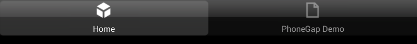
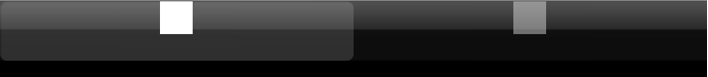

.. _tabbar_component:

=============================
TabBar
=============================

.. rst-class:: right-menu

TabBar
=========================

.. rst-class:: clear

TabBar component is used to switch page and placed at the bottom of the screen. The components used in Toolbar cannot be used inside TabBar. 

.. code-block:: javascript

  {
    "bottom": {
        "container" : "tabbar",
        "id" : "hoge",
        "style" : {
            "visibility": "true"
        },
        "items": [
            {
                "component": "tabbarItem",
                "style": {
                        "text": "Home",
                        "image": "images/index.png"
                },
                "link" : "index.html"
            },
            {
                "component": "tabbarItem",
                "style": {
                        "text": "Next",
                        "image": "images/next.png"
                },
                "link" : "next.html"
            },
            {
                "component": "tabbarItem",
                "style": {
                        "text": "Third",
                        "image": "images/third.png"
                },
                "link" : "third.html"
            }
        ]
      }
  }

Overview of UI Definition
^^^^^^^^^^^^^^^^^^^^^^^^^^^^^^^^^^^^^^

The TabBar component is defined as follows. 

.. literalinclude:: @tabbar/index.html
   :language: javascript

Settable Location
^^^^^^^^^^^^^^^^^^^^^^^^^

- Bottom  

Style Definition
^^^^^^^^^^^^^^^^^^^^^^^^^^^^^^^^^^^^^^

The following attributes can be applied to the TabBar style. Please put them in the ``"style"`` scope. 

+---------------------+--------------------------------------------------+---------------+------+--------+---------------+----------------------------+
|  Style              |  Description                                     |Android        |iOS6  | iOS7   |Value          |Default Value               |
+=====================+==================================================+===============+======+========+===============+============================+
|visibility           | The component visibility                         | Yes           | Yes  | Yes    | true/false    | true                       |
+---------------------+--------------------------------------------------+---------------+------+--------+---------------+----------------------------+
|opacity              | The transparency degree of the component         | Yes           | No   | No     | 0.0 to 1.0    | 1.0                        |
+---------------------+--------------------------------------------------+---------------+------+--------+---------------+----------------------------+
|backgroundColor      | The background color                             | Yes           | Yes  | No     | #RRGGBB       | #000000                    |
+---------------------+--------------------------------------------------+---------------+------+--------+---------------+----------------------------+
|translucent          | Set the translucent tabbar in iOS7               | No            | No   | Yes    | true/false    | false                      |
+---------------------+--------------------------------------------------+---------------+------+--------+---------------+----------------------------+
|activeIndex          | The current selected page index                  | Yes           | Yes  | Yes    | 0 and up      | 0                          |
+---------------------+--------------------------------------------------+---------------+------+--------+---------------+----------------------------+
|iosStyle             | iOS specific style definition                    | No            | Yes  | No     | iosStyle      | (none)                     |
+---------------------+--------------------------------------------------+---------------+------+--------+---------------+----------------------------+
|iosThemeColor        | Set the tabbarItem text color in iOS7            | No            | No   | Yes    | #RRGGBB       | #007AFF                    |
+---------------------+--------------------------------------------------+---------------+------+--------+---------------+----------------------------+
|androidStyle         | Android specific style definition                | Yes           | No   | No     |androidStyle   | (none)                     |
+---------------------+--------------------------------------------------+---------------+------+--------+---------------+----------------------------+

Other Definitions
^^^^^^^^^^^^^^^^^^^^^^^^^^^^^^^^^^^^^^

- ``id``: set the id of the component. This is required if the component needs to be controlled from :file:`monaca.js`.
- ``tabbarItem``: Define TabBar Items. Please read TabBar Item below for more information. 

TabBar Items
=============================

You can set a dedicated link to the TabBar item. 

Overview of UI Definition
^^^^^^^^^^^^^^^^^^^^^^^^^^^^^^^^^^^^^^

The TabBar item can be defined as below:

.. literalinclude:: @tabbar/index1.html
   :language: javascript

Settable Location
^^^^^^^^^^^^^^^^^^^^^^

- Items (inner Tabbar)

Style Definition
^^^^^^^^^^^^^^^^^^^^^^^^^^^^^^^^^^^^^^

The following attributes can be set for TabBar item style. Please put them in the ``"style"`` scope. 

+---------------------+--------------------------------------------------+---------------+-------+-------+---------------+--------------+
| Style               |  Description                                     | Android       |iOS6   | iOS7  |Value          |Default Value | 
+=====================+==================================================+===============+=======+=======+===============+==============+
|text                 | Specify text                                     | Yes           | Yes   | Yes   | String        | ""           |
+---------------------+--------------------------------------------------+---------------+-------+-------+---------------+--------------+
|image                | Specify image                                    | Yes           | Yes   | Yes   | File path     | ""           |
+---------------------+--------------------------------------------------+---------------+-------+-------+---------------+--------------+
|badgeText            | Show badge text to the tab bar items             | Yes           | Yes   | Yes   | String        | ""           |
+---------------------+--------------------------------------------------+---------------+-------+-------+---------------+--------------+
|iosStyle             | iOS specific style definition                    | No            | Yes   | No    | iosStyle      | (none)       |
+---------------------+--------------------------------------------------+---------------+-------+-------+---------------+--------------+
|androidStyle         | Android specific style definition                | Yes           | No    | No    | androidStyle  | (none)       |
+---------------------+--------------------------------------------------+---------------+-------+-------+---------------+--------------+

.. warning:: Tabbar item image must be a ``32bit PNG`` format, and the background needs to be ``transparent``. Also the image color is ignored, and alpha-channel is used as mask color. When not setting background as ``transparent``, the tabbar will display items in ``white``.

.. rst-class:: clear

Other Definitions
^^^^^^^^^^^^^^^^^^^^^^^^^^^^^^^^^^^^^^

- ``id``: set the id of the component. This is required if the component needs to be controlled from :file:`monaca.js`.
- ``link``: The linked page to be shown when the item is active. 

.. seealso::

  *See Also*

  - :ref:`native_control`
  - :ref:`toolbar_component`
  - :ref:`hardware_key`
  - :ref:`screen_orientation`
  - :ref:`background`
  - :ref:`native_menu_android`
  - :ref:`control_from_Javascript`