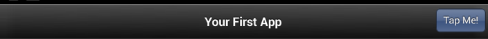

.. _toolbar_component:

====================================
Toolbar
====================================

.. rst-class:: right-menu

Toolbar
====================================

.. rst-class:: clear
 
ToolBar can be placed either on the top or bottom of the screen. The following components can be used in the Toolbar:

- :ref:`Button<Button>`
- :ref:`BackButton<BackButtonTool>`
- :ref:`Segment<Segment>`
- :ref:`Label<Label>`
- :ref:`SearchBox<SearchBox>`

.. note:: The above components cannot be placed at the center of the iOS Toolbar.

Overview of UI Definition
^^^^^^^^^^^^^^^^^^^^^^^^^^^^^^^^^^^^^^^^^

Below is an example of the Toolbar definition:

.. literalinclude:: @toolbar/index.html
   :language: javascript

Settable Location
^^^^^^^^^^^^^^^^^^^^^

- Top
- Bottom

Style Definition
^^^^^^^^^^^^^^^^^^^^^^^^^^^^^^^^^^^^^^^^^

The following attributes can be set for the ToolBar style. Please define them inside ``"style"``, ``"iosStyle"``, or ``"androidStyle"`` as appropriate.

+---------------------+--------------------------------------------------+-----------+-------+-------+---------------+------------------------------------+
| Style               |  Description                                     |Android    |iOS6   |iOS7   |Value          |Default Value                       | 
+=====================+==================================================+===========+=======+=======+===============+====================================+
|visibility           | The component visibility                         | Yes       | Yes   | Yes   | true/false    | true                               |
+---------------------+--------------------------------------------------+-----------+-------+-------+---------------+------------------------------------+
|translucent          | Set the translucent toolbar                      | No        | No    | Yes   | true/false    | false                              |
+---------------------+--------------------------------------------------+-----------+-------+-------+---------------+------------------------------------+
|opacity              | The transparency degree of the component         | Yes       | Yes   | No    | 0.0 to 1.0    | 1.0                                |
+---------------------+--------------------------------------------------+-----------+-------+-------+---------------+------------------------------------+
|shadowOpacity        | The transparency degree of the toolbar shadow    | Yes       | Yes   | No    | 0.0 to 1.0    | 0.3                                |
+---------------------+--------------------------------------------------+-----------+-------+-------+---------------+------------------------------------+
|backgroundColor      | The background color                             | Yes       | Yes   | Yes   | #RRGGBB       | #000000 (``iOS7``: #FFFFFF)        |
+---------------------+--------------------------------------------------+-----------+-------+-------+---------------+------------------------------------+
|title                | The title of the ToolBar aligned in the center   | Yes       | Yes   | Yes   | String        | ""                                 |
+---------------------+--------------------------------------------------+-----------+-------+-------+---------------+------------------------------------+
|titleImage           | The image displayed in the toolbar               | Yes       | Yes   | Yes   | String        | ""                                 |
+---------------------+--------------------------------------------------+-----------+-------+-------+---------------+------------------------------------+
|subtitle             | The subtitle of the ToolBar aligned in the center| Yes       | Yes   | Yes   | String        | ""                                 |
+---------------------+--------------------------------------------------+-----------+-------+-------+---------------+------------------------------------+
|titleColor           | The text color of the ToolBar title              | Yes       | Yes   | Yes   | #RRGGBB       | #FFFFFF (``iOS7``: #000000)        |
+---------------------+--------------------------------------------------+-----------+-------+-------+---------------+------------------------------------+
|subtitleColor        | The text color of the subtitle                   | Yes       | Yes   | Yes   | #RRGGBB       | #FFFFFF (``iOS7``: #000000)        |
+---------------------+--------------------------------------------------+-----------+-------+-------+---------------+------------------------------------+
|titleFontScale       | The scale of the title                           | Yes       | Yes   | Yes   | 0.0 and up    | 1.0                                |
+---------------------+--------------------------------------------------+-----------+-------+-------+---------------+------------------------------------+
|subtitleFontScale    | The scale of the subtitle                        | Yes       | Yes   | Yes   | 0.0 and up    | 1.0                                |
+---------------------+--------------------------------------------------+-----------+-------+-------+---------------+------------------------------------+
|iosBarStyle          | iOS specific style definition                    | No        | Yes   | Yes   |iosBarStyle*   | none (``iOS7``: UIBarStyleDefault) |
+---------------------+--------------------------------------------------+-----------+-------+-------+---------------+------------------------------------+
|iosStyle             | iOS specific style definition                    | No        | Yes   | No    | iosStyle      | none                               |
+---------------------+--------------------------------------------------+-----------+-------+-------+---------------+------------------------------------+
|iosThemeColor        |Set the navigation arrows color of toolbar in iOS7| No        | No    | Yes   | #RRGGBB       | #007AFF                            |
+---------------------+--------------------------------------------------+-----------+-------+-------+---------------+------------------------------------+
|androidStyle         | Android specific style definition                | Yes       | No    | No    | androidStyle  | none                               |
+---------------------+--------------------------------------------------+-----------+-------+-------+---------------+------------------------------------+

``iosBarStyle`` can be set with one of the following values according to the version of iOS:

``iOS6``:

- ``UIBarStyleBlack``: set the ToolBar color to black. 
- ``UIBarStyleBlackOpaque``: set the ToolBar color to black opaque. 
- ``UIBarStyleBlackTranslucent``: set the ToolBar color style to black and transparent. 
- ``UIBarStyleDefault``: set the default color value for the Toolbar. 

``iOS7``:

- ``UIBarStyleDefault``
- ``UIBarStyleDefault``

Other Definitions
^^^^^^^^^^^^^^^^^^^^^^^^^

- ``id``: set the id of the component. This is required if the component needs to be controlled from :file:`monaca.js`.
- ``left``: set the components on the left region of the ToolBar. 
- ``center``: set the components on the middle region of the ToolBar. This can be used only when both ``"title"`` and ``"subtitle"`` attributes are not set. 
- ``right``: set the components on the right region of the ToolBar. 

.. _Button:

.. rst-class:: function-reference

Button
===================================

Button component can be put on the ToolBar. If the button is used to go back to the previous page, please use :ref:`BackButtonTool` instead. 

Overview of UI Definition
^^^^^^^^^^^^^^^^^^^^^^^^^^^^^^^^^^^^^^^^^

The Button can be defined as below:

.. literalinclude:: @toolbar/index1.html
   :language: javascript

Settable Location
^^^^^^^^^^^^^^^^^^^^^^^^^^^

- Top: Left, Right
- Bottom: Left, Center, Right

Style Definition
^^^^^^^^^^^^^^^^^^^^^^^^^^^^^^^^^^^^^^^^^

The following attributes can be set for the Button style. Please define them inside ``"style"``, ``"iosStyle"``, or ``"androidStyle"`` as appropriate.

+---------------------+--------------------------------------------------+---------------+--------+----------+---------------+----------------------------+
| Style               |        Description                               |Android        |iOS6    | iOS7     |Value          |Default Value               | 
+=====================+==================================================+===============+========+==========+===============+============================+
|visibility           | The component visibility                         | Yes           | Yes    | Yes      | true/false    | true                       |
+---------------------+--------------------------------------------------+---------------+--------+----------+---------------+----------------------------+
|disable              | Disable or enable the component.                 | Yes           | Yes    | No       | true/false    | false                      |
+---------------------+--------------------------------------------------+---------------+--------+----------+---------------+----------------------------+
|opacity              | The transparency degree of the component         | Yes           | No     | No       | 0.0 to 1.0    | 1.0                        |
+---------------------+--------------------------------------------------+---------------+--------+----------+---------------+----------------------------+
|backgroundColor      | The background color                             | Yes           | Yes    | No       | #RRGGBB       | #000000                    |
+---------------------+--------------------------------------------------+---------------+--------+----------+---------------+----------------------------+
|activeTextColor      | The button text color when it is active          | Yes           | Yes    | No       | #RRGGBB       | #FFFFFF                    |
+---------------------+--------------------------------------------------+---------------+--------+----------+---------------+----------------------------+
|textColor            | The color of text                                | Yes           | Yes    | Yes      | #RRGGBB       | #FFFFFF (``iOS7``: #007AFF)|
+---------------------+--------------------------------------------------+---------------+--------+----------+---------------+----------------------------+
|image                |The button image path relative to :file:`.ui` file| Yes           | Yes    | Yes      | File path     | ""                         |
+---------------------+--------------------------------------------------+---------------+--------+----------+---------------+----------------------------+
|innerImage           |The button image path relative to :file:`.ui` file| Yes           | Yes    | No       | File path     | ""                         |
+---------------------+--------------------------------------------------+---------------+--------+----------+---------------+----------------------------+
|text                 | Specify text                                     | Yes           | Yes    | Yes      | String        | ""                         |
+---------------------+--------------------------------------------------+---------------+--------+----------+---------------+----------------------------+
|iosStyle             | iOS specific style definition                    | No            | Yes    | No       | iosStyle      | (none)                     |
+---------------------+--------------------------------------------------+---------------+--------+----------+---------------+----------------------------+
|androidStyle         | Android specific style definition                | Yes           | No     | No       | androidStyle  | (none)                     |
+---------------------+--------------------------------------------------+---------------+--------+----------+---------------+----------------------------+

Other Definitions
^^^^^^^^^^^^^^^^^^^^^^^^^^^^^^^^^^^^^^^^^

- ``id``: set the id of the component. This is required if the component needs to be controlled from :file:`monaca.js`.
- ``event``: describe the event definition of the button. 
- ``onTap``: define the JavaScript code to run when the button is pressed. 

.. note:: iOS Button doesn't support ``opacity`` attribute.

.. _BackButtonTool:

.. rst-class:: function-reference

BackButton
===========================

The BackButton is put inside ToolBar. The button is semantically styled for going back to previous page behavior. If you need normal button, please use :ref:`Button` component.

Overview of UI Definition
^^^^^^^^^^^^^^^^^^^^^^^^^^^^^^^^^^

The BackButton can be defined as below:

.. literalinclude:: @toolbar/index2.html
   :language: javascript
  
.. note:: Android does not display Backbutton when you define it in ``ui`` File. To display Backbutton, set ``forceVisibility`` as ``"true"``. Arrow type button displays on iOS only.

Settable Location
^^^^^^^^^^^^^^^^^^^^^^^^

- Top: Left

Style Definition
^^^^^^^^^^^^^^^^^^^^^^^^^^^

.. note:: In iOS7, it is not applicable to apply ``"monaca.updateUIStyle"`` to BackButton.

The following attributes can be set for the BackButton style. Please put them in the ``"style"`` scope. 

+---------------------+-----------------------------------------------------------------------------------------------------------------------------------------------+---------------+------+--------+---------------+----------------------------+
|  Style              |   Description                                                                                                                                 |Android        |iOS6  |iOS7    |Value          |Default Value               |
+=====================+===============================================================================================================================================+===============+======+========+===============+============================+
|visibility           | The component visibility                                                                                                                      | Yes           | Yes  | Yes    | true/false    | true                       |
+---------------------+-----------------------------------------------------------------------------------------------------------------------------------------------+---------------+------+--------+---------------+----------------------------+
|disable              | Disable or enable the component.                                                                                                              | Yes           | No   | No     | true/false    | false                      |
+---------------------+-----------------------------------------------------------------------------------------------------------------------------------------------+---------------+------+--------+---------------+----------------------------+
|opacity              | The transparency degree of the component                                                                                                      | Yes           | No   | No     | 0.0 to 1.0    | 1.0                        |
+---------------------+-----------------------------------------------------------------------------------------------------------------------------------------------+---------------+------+--------+---------------+----------------------------+
|activeTextColor      | The button text color when it is active                                                                                                       | Yes           | Yes  | No     | #RRGGBB       | #FFFFFF                    |
+---------------------+-----------------------------------------------------------------------------------------------------------------------------------------------+---------------+------+--------+---------------+----------------------------+
|textColor            | The color of text                                                                                                                             | Yes           | Yes  | Yes    | #RRGGBB       | #FFFFFF (``iOS7``: #007AFF)|
+---------------------+-----------------------------------------------------------------------------------------------------------------------------------------------+---------------+------+--------+---------------+----------------------------+
|text                 | The text to be displayed inside the button                                                                                                    | Yes           | Yes  | Yes    | String        | ""                         |
+---------------------+-----------------------------------------------------------------------------------------------------------------------------------------------+---------------+------+--------+---------------+----------------------------+
|image                |The BackButton image path relative to the .ui file                                                                                             | Yes           | No   | Yes    | File path     | ""                         |
+---------------------+-----------------------------------------------------------------------------------------------------------------------------------------------+---------------+------+--------+---------------+----------------------------+
|innerImage           |The inner image path relative to the .ui file                                                                                                  | Yes           | Yes  | No     | File path     | ""                         |
+---------------------+-----------------------------------------------------------------------------------------------------------------------------------------------+---------------+------+--------+---------------+----------------------------+
|forceVisibility      |It applies for Android devices only since the "Back" behavior can be achieved by using Hardware Back button. Thus, it is invisible by default. | Yes           | No   | No     | true/false    | false                      |
+---------------------+-----------------------------------------------------------------------------------------------------------------------------------------------+---------------+------+--------+---------------+----------------------------+
|iosStyle             | iOS specific style definition                                                                                                                 | No            | Yes  | No     | iosStyle      | (none)                     |
+---------------------+-----------------------------------------------------------------------------------------------------------------------------------------------+---------------+------+--------+---------------+----------------------------+
|androidStyle         | Android specific style definition                                                                                                             | Yes           | No   | No     | androidStyle  | (none)                     |
+---------------------+-----------------------------------------------------------------------------------------------------------------------------------------------+---------------+------+--------+---------------+----------------------------+

Other Definitions
^^^^^^^^^^^^^^^^^^^^^^^^^^^^

- ``id``: set the id of the component. This is required if the component needs to be controlled from :file:`monaca.js`.
- ``event``: describe the event definition of the button. 
- ``onTap``: define the JavaScript code to run when the button is pressed. 

.. _Segment:

.. rst-class:: function-reference

Segment
==================

The Segment component is put inside the ToolBar. 

.. note:: In iOS, text style is required in order to create segment.

Overview of UI Definition
^^^^^^^^^^^^^^^^^^^^^^^^^^^^^^^^^^^

It can be defined as below:

.. literalinclude:: @toolbar/index3.html
   :language: javascript

Settable Location
^^^^^^^^^^^^^^^^^^^^^^^^

- Top: Left, Right
- Bottom: Left, Center, Right

Style Definition
^^^^^^^^^^^^^^^^^^^^^^^^^

The following attributes can be set for the Segment style. Please put them in the ``"style"`` scope.

+---------------------+--------------------------------------------------+------------+------+------+-------------------------+-------------------------+
| Style               | Description                                      |Android     |iOS6  | iOS7 |Value                    |Default Value            | 
+=====================+==================================================+============+======+======+=========================+=========================+
|visibility           | The component visibility                         | Yes        | Yes  | Yes  | true/false              | true                    |
+---------------------+--------------------------------------------------+------------+------+------+-------------------------+-------------------------+
|backgroundColor      | The background color                             | Yes        | Yes  | No   | #RRGGBB                 | #000000                 |
+---------------------+--------------------------------------------------+------------+------+------+-------------------------+-------------------------+
|activeTextColor      | The button text color when it is active          | Yes        | Yes  | Yes  | #RRGGBB                 | #FFFFFF (``iOS7``: none)|
+---------------------+--------------------------------------------------+------------+------+------+-------------------------+-------------------------+
|textColor            | The color of text                                | Yes        | Yes  | Yes  | #RRGGBB                 | #FFFFFF (``iOS7``: none)|
+---------------------+--------------------------------------------------+------------+------+------+-------------------------+-------------------------+
|texts                |The array of texts for each segment item          | Yes        | Yes  | Yes  | array                   | [ ]                     |
+---------------------+--------------------------------------------------+------------+------+------+-------------------------+-------------------------+
|activeIndex          |The current active segment index of item          | Yes        | Yes  | Yes  | 0 and uptexts.length-1  | 0                       |
+---------------------+--------------------------------------------------+------------+------+------+-------------------------+-------------------------+
|iosStyle             | iOS specific style definition                    | No         | Yes  | No   | iosStyle                | (none)                  |
+---------------------+--------------------------------------------------+------------+------+------+-------------------------+-------------------------+
|androidStyle         | Android specific style definition                | Yes        | No   | No   | androidStyle            | (none)                  |
+---------------------+--------------------------------------------------+------------+------+------+-------------------------+-------------------------+

Other Definitions
^^^^^^^^^^^^^^^^^^^^^^^^^^^

- ``id``: set the id of the component. This is required if the component needs to be controlled from :file:`monaca.js`.
- ``event``: describe the event definition of the button. 
- ``onChange``: define the JavaScript code to run when the button becomes active. 

.. _Label:

.. rst-class:: function-reference

Label
=====================

The Label component is put inside the ToolBar. 

Overview of UI Definition
^^^^^^^^^^^^^^^^^^^^^^^^^^^^^^^^^

It is defined as below:

.. literalinclude:: @toolbar/index4.html
   :language: javascript

Settable Location
^^^^^^^^^^^^^^^^^^^^^^^^^

- Top: Left, Right
- Bottom: Left, Center, Right

Style Definition
^^^^^^^^^^^^^^^^^^^^^^^^^^

The following attributes can be set for the Label style. Please put them in the ``"style"`` scope.

+---------------------+--------------------------------------------------+---------------+------+--------+---------------+----------------------------+
|  Style              | Description                                      |Android        | iOS6 | iOS7   |Value          |Default Value               | 
+=====================+==================================================+===============+======+========+===============+============================+
|opacity              | The transparency degree of the component         | Yes           | No   | Yes    | 0.0 to 1.0    | 1.0                        |
+---------------------+--------------------------------------------------+---------------+------+--------+---------------+----------------------------+
|visibility           | The component visibility                         | Yes           | Yes  | Yes    | true/false    | true                       |
+---------------------+--------------------------------------------------+---------------+------+--------+---------------+----------------------------+
|textColor            | The color of text                                | Yes           | Yes  | Yes    | #RRGGBB       | #FFFFFF (``iOS7``: #000000)|
+---------------------+--------------------------------------------------+---------------+------+--------+---------------+----------------------------+
|text                 | The label text                                   | Yes           | Yes  | Yes    | String        | ""                         |
+---------------------+--------------------------------------------------+---------------+------+--------+---------------+----------------------------+
|iosStyle             | iOS specific style definition                    | No            | Yes  | No     | iosStyle      | (none)                     |
+---------------------+--------------------------------------------------+---------------+------+--------+---------------+----------------------------+
|androidStyle         | Android specific style definition                | Yes           | No   | No     | androidStyle  | (none)                     |
+---------------------+--------------------------------------------------+---------------+------+--------+---------------+----------------------------+

Other Definitions
^^^^^^^^^^^^^^^^^^^^^^^^^^^^^^^

- id: set the id of the component. This is required if the component needs to be controlled from :file:`monaca.js`.

.. _SearchBox:

.. rst-class:: function-reference

SearchBox
=============================

The SearchBox component is put inside the ToolBar. 

Overview of UI Definition
^^^^^^^^^^^^^^^^^^^^^^^^^^^^^^^^

It is defined as below:

.. literalinclude:: @toolbar/index5.html
   :language: javascript

Settable Location
^^^^^^^^^^^^^^^^^^^^^^^

- Top: Left, Right

Style Definition
^^^^^^^^^^^^^^^^^^^^^^^^^^

The following attributes can be set for SearchBox style. Please put them in the ``"style"`` scope. 

+---------------------+--------------------------------------------------+---------------+------+--------+---------------+--------------+
| Style               |  Description                                     |Android        |iOS6  | iOS7   |Value          |Default Value | 
+=====================+==================================================+===============+======+========+===============+==============+
|visibility           | The component visibility                         | Yes           | Yes  | Yes    | true/false    | true         |
+---------------------+--------------------------------------------------+---------------+------+--------+---------------+--------------+
|disable              | Disable or enable the component.                 | Yes           | Yes  | Yes    | true/false    | false        |
+---------------------+--------------------------------------------------+---------------+------+--------+---------------+--------------+
|opacity              | The transparency degree of the component         | Yes           | Yes  | Yes    | 0.0 to 1.0    | 1.0          |
+---------------------+--------------------------------------------------+---------------+------+--------+---------------+--------------+
|backgroundColor      | The background color                             | Yes           | No   | Yes    | #RRGGBB       | #FFFFFF      |
+---------------------+--------------------------------------------------+---------------+------+--------+---------------+--------------+
|textColor            | The color of text                                | Yes           | Yes  | Yes    | #RRGGBB       | #000000      |
+---------------------+--------------------------------------------------+---------------+------+--------+---------------+--------------+
|placeholder          |The placeholder text                              | Yes           | Yes  | Yes    | File path     | ""           |
+---------------------+--------------------------------------------------+---------------+------+--------+---------------+--------------+
|focus                |Set wether the component should have focus or not.| Yes           | Yes  | Yes    | true/false    | false        |
+---------------------+--------------------------------------------------+---------------+------+--------+---------------+--------------+
|iosStyle             | iOS specific style definition                    | No            | Yes  | No     | iosStyle      | none         |
+---------------------+--------------------------------------------------+---------------+------+--------+---------------+--------------+
|androidStyle         | Android specific style definition                | Yes           | No   | No     | androidStyle  | none         |
+---------------------+--------------------------------------------------+---------------+------+--------+---------------+--------------+

Other Definitions
^^^^^^^^^^^^^^^^^^^^^^^^

- ``id``: set the id of the component. This is required if the component needs to be controlled from :file:`monaca.js`.
- ``event``: describe the event definition of the button. 
  - ``onSearch``: define the JavaScript code to run when the search event occurred.

.. seealso::

  *See Also*

  - :ref:`native_control`
  - :ref:`tabbar_component`
  - :ref:`hardware_key`
  - :ref:`screen_orientation`
  - :ref:`background`
  - :ref:`native_menu_android`
  - :ref:`control_from_Javascript`