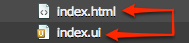
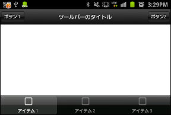

.. _ui_definition:

--------------------------------
UI Definition
--------------------------------

.. rst-class:: right-menu

Native UI is created by a :file:`*.ui` file. And this :file:`ui` file is described as JSON.

The :file:`*.ui` file will be applied to its corresponding :file:`*.html` file with the same name. For example, :file:`index.ui` will be applied to :file:`index.html`.

.. note:: In case of ``iOS7``, the :file:`*@ios7.ui` file will be applied to its corresponding :file:`*.html`. For example, :file:`index@ios7.ui` will be applied to :file:`index.html`.

The layout of native component falls into 3 regions: Top, Middle, and Bottom. The middle region is used to display your HTML page while the top and bottom regions are used for Toolbar or TabBar component. 

Depending on the regions, there are restrictions to where each component can be placed as listed below:

- ``Top``: only for Toolbar component
- ``Bottom``: for Toolbar or TabBar component

The layout definition is written in JSON format as show in the example below. Please note that, in JSON the hash key must be enclosed in double quote " ". 

.. literalinclude:: @ui_definition/index.html
   :language: javascript

  

For instance, the following snippet sets a Toolbar on the top region and a TabBar in the bottom region.

.. literalinclude:: @ui_definition/index1.html
   :language: javascript

This is what the result looks like:

.. warning:: In Android, when using :file:`.ui` file with ``iFrame`` in the webview, the native component is not displayed. However, there is a workaround for this problem by adding ``#embedding`` to the ``URL`` of the ``iFrame``.

For example, the native component will disappear when it is used with ``iFrame`` as follows:

::

  <iframe src="www.google.com"/> 

But if you use the following code, the native component will appear.

::

  <iframe src="www.google.com#embedding"/>

.. seealso::

  *See Also*

  - :ref:`native_control`
  - :ref:`toolbar_component`
  - :ref:`hardware_key`
  - :ref:`screen_orientation`
  - :ref:`background`
  - :ref:`tabbar_component`
  - :ref:`control_from_Javascript`