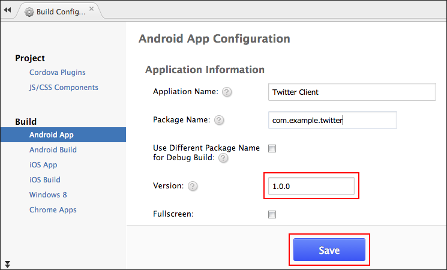
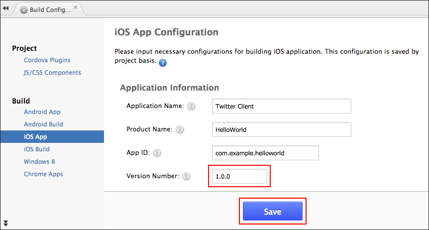

.. _inapp_updater_plugin:

-------------------------------------------
Monaca In-App Updater (Enterprise)
-------------------------------------------

.. rst-class:: right-menu

This plugin updates HTML5 assets contained in the app without rebuilding and packaging the app. You need a Web server to host the updated files which will be accessed from the app.

.. note:: This plugin is available to Enterprise users only.

Supported Platforms
==========================

- Cordova 4.1 or later
- iOS 7 or later
- Android 4.0 or later

Usage
=========

Please follow these steps to use this plugin.

1. Enable the plugin. (See :ref:`enable_in_app_updater`.)

2. Choose the update mode and specify the deploy URL. (See :ref:`update_mode`.) 

3. Create the update files for intended OS with proper version. (See :ref:`create_update_file` and :ref:`update_file_version`.)

4. Create configuration file specifying the version number of the update files. (See :ref:`config_file_in_app_updater`.)

5. Place the configuration and update files in the same directory level. (See :ref:`files_placement`.)

.. _enable_in_app_updater:

Enable Plugin in Monaca
===========================

1. From Monaca Cloud IDE menu, go to :menuselection:`File --> Manage Cordova Plugins` or :menuselection:`Config --> Manage Cordova Plugins`.

2. Click :guilabel:`Enable` button of the ``Monaca In-App Updater`` to add it into your project.

  .. image:: images/in-app_updater/1.png  
         :width: 700px

3. Next, you need to configure necessary information for this plugin. Find your newly added plugin under the *Enable Plugins* section. Then, hover the plugin and click :guilabel:`Config` button.

  .. image:: images/in-app_updater/2.png
      :width: 700px
    
2. There are two update modes for this plugins: `default` and `severe` (see :ref:`update_mode`). Choose an appropriate mode and enter the deploy URL where the file is downloaded from. Then, click :guilabel:`OK` button.

  .. image:: images/in-app_updater/3.png
      :width: 400px

Plugin Configuration
===============================

.. _update_mode:

Update Mode
^^^^^^^^^^^^^^^^^^^^^

When there are available updates, the application will try to update the app according to the predefined update mode. 

=============== ===============================================================================================================================================
Mode             Description                                                                                    
=============== ===============================================================================================================================================
Default          Allow the application to run even the update process cannot be done.
Severe           The application cannot run if the update process cannot be done. For instance, if the application has no network connectivity, the app will exit.
=============== ===============================================================================================================================================

These settings are stored in :file:`config.xml` file as shown below.

.. code-block:: javascript
                                  
  <preference name="monaca:UpdateMode" value="default"/>
  <preference name="monaca:UpdateUrl" value="DEPLOY_URL"/>

.. _create_update_file: 

Creating Update File
^^^^^^^^^^^^^^^^^^^^^^^^^^^^

In order to use this plugin, you will need a :file:`update.json` file in addition to Android and/or iOS update files.

=============================== ============================ ===================================================================================================
File Name                        Description                  Remarks
=============================== ============================ ===================================================================================================
:file:`update.json`              Update configuration file    The version of update file is specified in this configuration file.
:file:`android-v1.0.0.zip`       Android update file          The version of each update file is shown at the end of the file. See :ref:`update_file_version`.
:file:`ios-v1.0.0.zip`           iOS update file              The version of each update file is shown at the end of the file. See :ref:`update_file_version`.
=============================== ============================ ===================================================================================================

.. note:: Each update file (Androin and iOS) is corresponded to respective OS. Therefore, it's possible to just update the app for iOS or Android depending on the update file you use.

In order to create the update file, please do as follows:

1. From Monaca Cloud IDE, go to :menuselection:`Build --> Build App for iOS` for iOS or go to :menuselection:`Build --> Build App for Android` for Android.

2. Choose :guilabel:`Create a package for In-App Update` option and click :guilabel:`Next` button (same for Android).

  .. image:: images/in-app_updater/4.png
      :width: 500px

3. It may takes sometimes to create the package. So please wait.

4. When the package is ready, the following screen will be displayed. Click to download the update package.

  .. image:: images/in-app_updater/5.png
      :width: 400px

.. _update_file_version:

Update File Version
^^^^^^^^^^^^^^^^^^^^^^^^^^^^^^^^^^^^^^^^^^^^^^

The update files include their version number. You can update the version of the update file by the following steps:

1. From Monaca Cloud IDE, go to :menuselection:`Config --> iOS App Settings` for iOS or go to :menuselection:`Config --> Android App Settings` for Android.

2. Enter the version number and click :guilabel:`Save` button.

    Android

    iOS

.. note:: Android and iOS version do not necessarily be the same.

.. _config_file_in_app_updater:

Creating Configuration File
^^^^^^^^^^^^^^^^^^^^^^^^^^^^^

As mention above, :file:`update.json` file is an update configuration file to store the version information of the update files. Below is an example of the configuration file:

.. code-block:: javascript
                                  
  {
    "ios": { "version": "1.0.0" }, 
    "android": { "version": "1.0.0" }
  }

In this example, ``"ios": { "version": "1.0.0" }`` means that ``ios-v1.0.0.zip`` file will be used to download.

.. _files_placement:

Placing Update File
^^^^^^^^^^^^^^^^^^^^^^

Please make sure to place the configuration and update files in the same level. For example, if your deploy URL is ``http://example.com/``, then your files should be placed as follows:

- http://example.com/update.json 
- http://example.com/ios-v1.0.0.zip 
- http://example.com/android-v1.0.0.zip

.. note:: The server can be distributed in any environment at least the application has the connectivity.

App Store Submission
=============================

Please aware that this plugin might interfere with the `App Store Review Guidelines <https://developer.apple.com/app-store/review/guidelines/#functionality>`_ in the following conditions.

.. note:: This applies to the apps that is distributed on App Store. Privately distributed apps (including Ad-Hoc and Enterprise Built) are excluded from the review guideline.

- "2.7 Apps that download code in any way or form will be rejected"

- "2.8 Apps that install or launch other executable code will be rejected"

.. seealso::

  *See Also*

  - :ref:`third_party_cordova_index`
  - :ref:`cordova_core_plugins`