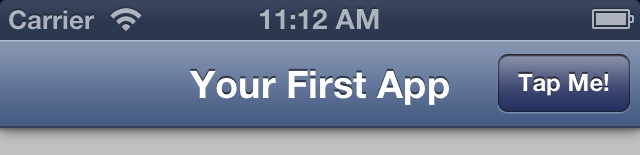
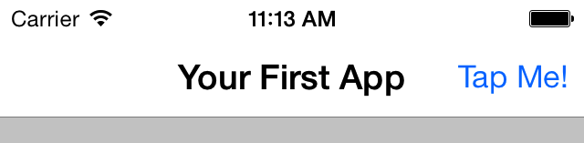
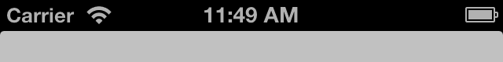
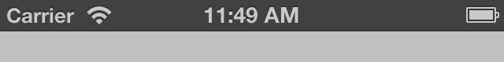

.. _ios_status_bar_plugin:

-----------------------------------
  iOS Status Bar Plugin
-----------------------------------

.. rst-class:: right-menu

This plugin is used to controll the properties and behaviour of the status bar in iOS. 

Enable Plugin in Monaca
===========================

.. note:: This plugin is enabled by default. 

Methods
===========================

With iOS Status Bar plugin in Monaca, the following functions can be used:

=========================================================================================== ================= ===============================================================================================
Method/Property                                                                               Support          Description
=========================================================================================== ================= ===============================================================================================
:ref:`window.StatusBar.hideStatusBar()<hideStatusBar>`                                        iOS 6, iOS 7      Hide the status bar

:ref:`window.StatusBar.showStatusBar()<ShowStatusBar>`                                        iOS 6, iOS 7      Show the status bar

:ref:`window.StatusBar.statusBarStyleDefault()<statusBarStyleDefault>`                        iOS 6, iOS 7      Apply the default style to the status bar

:ref:`window.StatusBar.statusBarStyleLightContent()<statusBarStyleLightContent>`              iOS 7             Apply the light content style to the status bar

:ref:`window.StatusBar.statusBarStyleBlackOpaque()<statusBarStyleBlackOpaque>`                iOS 6             Apply the black opaque style to the status bar

:ref:`window.StatusBar.statusBarStyleBlackTranslucent()<statusBarStyleBlackTranslucent>`      iOS 6             Apply the black translucent style to the status bar
=========================================================================================== ================= ===============================================================================================

Image list of the iOS status bar:

=========================================================================================== ================= ========================================
Image                                                                                         Version          Description
=========================================================================================== ================= ========================================
  |iOS6Default|                                                                                iOS 6            Default style
  |iOS7Default|                                                                                iOS 7            Default style
  |iOS7L|                                                                                      iOS 7            Light content style
  |iOS6D|                                                                                      iOS 6            Black opaque style
  |iOS6T|                                                                                      iOS 6            Black translucent style
=========================================================================================== ================= ========================================

.. rst-class:: function-reference
.. _hideStatusBar:

window.StatusBar.hideStatusBar()
^^^^^^^^^^^^^^^^^^^^^^^^^^^^^^^^^^^^^^^^^^^^^^^^^^^^^^^^^^^^^^^^^^^^^^^^^^^^^^

Use this function to hide the status bar.

:dfn:`window.StatusBar.hideStatusBar()`

Parameter
  =================== =========================================================================================================================================
  ``None``
  =================== =========================================================================================================================================

Return Value
  =================== =========================================================================================================================================
  ``None``
  =================== =========================================================================================================================================

.. rst-class:: function-reference

.. _ShowStatusBar:

window.StatusBar.ShowStatusBar()
^^^^^^^^^^^^^^^^^^^^^^^^^^^^^^^^^^^^^^^^^^^^^^^^^^^^^^^^^^^

Use this function to show the status bar.

:dfn:`window.StatusBar.showStatusBar()`

Parameter
  =================== =========================================================================================================================================
  ``None``
  =================== =========================================================================================================================================

Return Value
  =================== =========================================================================================================================================
  ``None``
  =================== =========================================================================================================================================

.. rst-class:: function-reference

.. _statusBarStyleDefault:

window.StatusBar.statusBarStyleDefault()
^^^^^^^^^^^^^^^^^^^^^^^^^^^^^^^^^^^^^^^^^^^^^^^^^^^^^^^^^^^^^^^^^^^^^^^^^^^^^^^^^^^^^^^^^^

Apply the default style to the status bar.

:dfn:`window.StatusBar.statusBarStyleDefault()`

Parameter
  =================== =========================================================================================================================================
  ``None``
  =================== =========================================================================================================================================

Return Value
  =================== =========================================================================================================================================
  ``None``
  =================== =========================================================================================================================================

.. rst-class:: function-reference

.. _statusBarStyleLightContent:

window.StatusBar.statusBarStyleLightContent()
^^^^^^^^^^^^^^^^^^^^^^^^^^^^^^^^^^^^^^^^^^^^^^^^^^^^^^^^^^^^^^^^^^^^^^^^^^^^^^^^^^^^^^^^^^^^^^^^^^^^^^^^^^

Apply the light content style to the status bar.

:dfn:`window.StatusBar.statusBarStyleLightContent()`

Parameter
  =================== =========================================================================================================================================
  ``None``
  =================== =========================================================================================================================================

Return Value
  =================== =========================================================================================================================================
  ``None``
  =================== =========================================================================================================================================

.. rst-class:: function-reference

.. _statusBarStyleBlackOpaque:

window.StatusBar.statusBarStyleBlackOpaque()
^^^^^^^^^^^^^^^^^^^^^^^^^^^^^^^^^^^^^^^^^^^^^^^^^^^^^^^^^^^^^^^^^^^^^^^^^^^^^^^^^^^^^^^^^^^^^^^^^^^^^^^^^^^

Apply the black opaque style to the status bar.

:dfn:`window.StatusBar.statusBarStyleBlackOpaque()`

Parameter
  =================== =========================================================================================================================================
  ``None``
  =================== =========================================================================================================================================

Return Value
  =================== =========================================================================================================================================
  ``None``
  =================== =========================================================================================================================================

.. rst-class:: function-reference

.. _statusBarStyleBlackTranslucent:

window.StatusBar.statusBarStyleBlackTranslucent()
^^^^^^^^^^^^^^^^^^^^^^^^^^^^^^^^^^^^^^^^^^^^^^^^^^^^^^^^^^^^^^^^^^^^^^^^^^^^^^^^^^^^^^^^^^^^^^^^^^^^^^^^^^^^^^^^^^^^^^^^^^^

Apply the black translucent style to the status bar

:dfn:`window.StatusBar.statusBarStyleBlackTranslucent()`

Parameter
  =================== =========================================================================================================================================
  ``None``
  =================== =========================================================================================================================================

Return Value
  =================== =========================================================================================================================================
  ``None``
  =================== =========================================================================================================================================

.. seealso::

  *See Also*

  - :ref:`third_party_cordova_index`
  - :ref:`cordova_core_plugins`