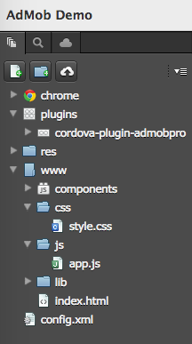
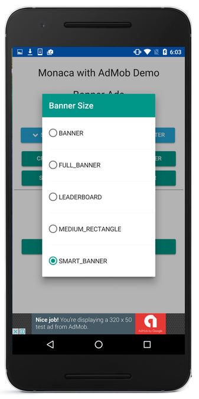
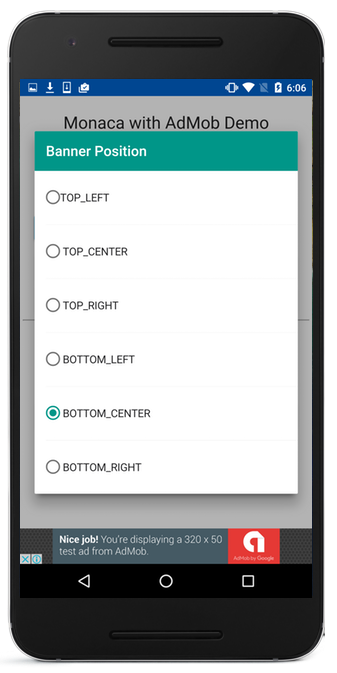

.. _admob_sample:

============================================
AdMob Demo
============================================

In this page, we will show how to integrate Monaca with the most common mobile ads network called, `AdMob <https://www.google.com/admob/>`_. 

  .. figure:: images/admob/1.png
     :width: 337px
     :align: left
     
     Banner Ads

  .. figure:: images/admob/2.png
     :width: 337px
     :align: left
     
     Interstitial Ads

  .. rst-class:: clear

:download:`Click here to download the project <download/admob.zip>`

Prerequisites
============================================

1. Register with AdMob.
2. Register your app with AdMob.
3. Add `AdMob Plugin Pro <https://github.com/floatinghotpot/cordova-admob-pro>`_ to your project.

File Components
=========================

.. rst-class:: clear

======================== ===================================================================================================================================== 
``index.html``             The startup Page

``js/app.js``              JavaScript file handling app execution.

``css/style.css``          A stylesheet file for the application
======================== =====================================================================================================================================

Required JS/CSS Components 
^^^^^^^^^^^^^^^^^^^^^^^^^^^^

============================ ============================
``jQuery``
``Onsen UI``
============================ ============================

Required Cordova Plugins
^^^^^^^^^^^^^^^^^^^^^^^^^^^^

============================ ============================
``AdMob Plugin Pro``
============================ ============================

HTML Explanation
=======================

In this demo app, we use `OnsenUI <https://onsen.io/>`_, HTML5 Hybrid Mobile App Framework and UI Components for PhoneGap & Cordova. 

Startup Page
^^^^^^^^^^^^^^^^^^^^^^

The following block code represents the UI of the startup page of the project.

::

    ...
    <h3 style="text-align: center;">Monaca with AdMob Demo</h3>
            
    

        <h3>Banner Ads</h3>
                
        <ons-input type="checkbox" id='overlap'>  overlap</ons-input>
        &nbsp;&nbsp;&nbsp;
        <ons-input type="checkbox" id='offsetTopBar'>  offsetTopBar</ons-input>
          
        <ons-button id='btn_size' style="font-size: 80%; background-color: #25a6d9" onclick='show("banner_size.html", "btn_size");'>
            <ons-icon icon="fa-chevron-down" fixed-width="false"></ons-icon>
            SMART_BANNER
        </ons-button>
        <ons-button id='btn_pos' style="font-size: 80%; background-color: #25a6d9" onclick='show("banner_pos.html", "btn_pos");'>
            <ons-icon icon="fa-chevron-down" fixed-width="false"></ons-icon>
            BOTTOM_CENTER
        </ons-button>
          
        <ons-row>
            <ons-col>
                <ons-button id='btn_create'>Create Banner</ons-button>
                <ons-button id='btn_remove'>Remove Banner</ons-button>        
            </ons-col>
        </ons-row>
        <ons-row style="height: 10px;"></ons-row>
        <ons-row>
            <ons-col>
                <ons-button id='btn_show'>Show Banner</ons-button>
                <ons-button id='btn_hide'>Hide Banner</ons-button>                
            </ons-col>
        </ons-row>
        

    
        <h3>Interstitial Ads</h3>
        <ons-input id="autoshow" type="checkbox" checked>  auto show when ready</ons-input>
          
        <ons-button id="btn_prepare">Prepare</ons-button>
        <ons-button id="btn_showfull">Show</ons-button>

    
   
    ...

     
    Startup Page

.. rst-class:: clear

Ads Size Dialog
^^^^^^^^^^^^^^^^^^^^^^

The following block code represents the Ads Size dialog allowing users to select various types of AdMob's ads size such as ``SMART_BANNER``, ``MEDIUM_RECTANGLE``, ``FULL_BANNER`` and so on.

::

    ...
    <ons-template id="banner_size.html">
        <ons-dialog var="dialog" cancelable mask-color="rgba(0, 0, 0, 0.7)">
            

                <ons-toolbar inline>
                    

                        Banner Size
                    

                </ons-toolbar>
                
                <ons-list style="margin:0; padding:0; font-size: 90%;">
                    <ons-list-item modifier="tappable">
                        <ons-input type="radio" name="radio" value='BANNER'>  BANNER</ons-input>
                    </ons-list-item>
                    <ons-list-item modifier="tappable">
                        <ons-input type="radio" name="radio" value='FULL_BANNER'>  FULL_BANNER</ons-input>
                    </ons-list-item>
                    <ons-list-item modifier="tappable">
                        <ons-input type="radio" name="radio" value='LEADERBOARD'>  LEADERBOARD</ons-input>
                    </ons-list-item>
                    <ons-list-item modifier="tappable">
                        <ons-input type="radio" name="radio" value='MEDIUM_RECTANGLE'>  MEDIUM_RECTANGLE</ons-input>
                    </ons-list-item>
                    <ons-list-item modifier="tappable">
                        <ons-input type="radio" name="radio" value="SMART_BANNER" checked>  SMART_BANNER</ons-input>
                    </ons-list-item>
                </ons-list>
            

        </ons-dialog>
    </ons-template>   
    ...

     
    Ads Size Dialog

.. rst-class:: clear

Ads Position Dialog
^^^^^^^^^^^^^^^^^^^^^^

The following block code represents the Ads Position dialog allowing users to select various positions to place the ads such as ``TOP_LEFT``, ``CENTER``, ``BOTTOM_RIGHT`` and so on.

::

    ...
    <ons-template id="banner_pos.html">
        <ons-dialog var="dialog" cancelable mask-color="rgba(0, 0, 0, 0.7)" style="width: 90%; height: auto">
            

                <ons-toolbar inline>
                    

                        Banner Position
                    

                </ons-toolbar>
                
                <ons-list style="margin:0; padding:0; font-size: 90%">
                    <ons-list-item modifier="tappable">
                        <ons-input type="radio" id="radio1" name="radio" value='1'>TOP_LEFT</ons-input>    
                    </ons-list-item>    
                    <ons-list-item modifier="tappable">
                        <ons-input type="radio" id="radio1" name="radio" value='2'>  TOP_CENTER</ons-input>        
                    </ons-list-item>
                    <ons-list-item modifier="tappable">
                        <ons-input type="radio" id="radio1" name="radio" value='3'>  TOP_RIGHT</ons-input>
                    </ons-list-item>
                    <!--<ons-list-item modifier="tappable">
                        <ons-input type="radio" id="radio1" name="radio" value='4'>  LEFT</ons-input>    
                    </ons-list-item>    
                    <ons-list-item modifier="tappable">
                        <ons-input type="radio" id="radio1" name="radio" value='5'>  CENTER</ons-input>        
                    </ons-list-item>
                    <ons-list-item modifier="tappable">
                        <ons-input type="radio" id="radio1" name="radio" value='6'>  RIGHT</ons-input>
                    </ons-list-item>-->
                    <ons-list-item modifier="tappable">
                        <ons-input type="radio" id="radio1" name="radio" value='7'>  BOTTOM_LEFT</ons-input>
                    </ons-list-item>
                    <ons-list-item modifier="tappable">
                        <ons-input type="radio" id="radio1" name="radio" value='8' checked>  BOTTOM_CENTER</ons-input>
                    </ons-list-item>
                    <ons-list-item modifier="tappable">
                        <ons-input type="radio" id="radio1" name="radio" value='9'>  BOTTOM_RIGHT</ons-input>
                    </ons-list-item>
                </ons-list>
            

        </ons-dialog>
    </ons-template>  
    ...

     
    Ads Position Dialog

.. rst-class:: clear

JavaScript Explanation
===================================

[TBU]

