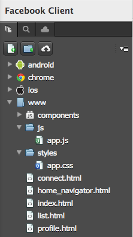
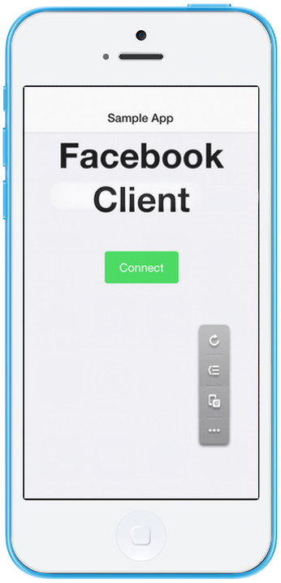
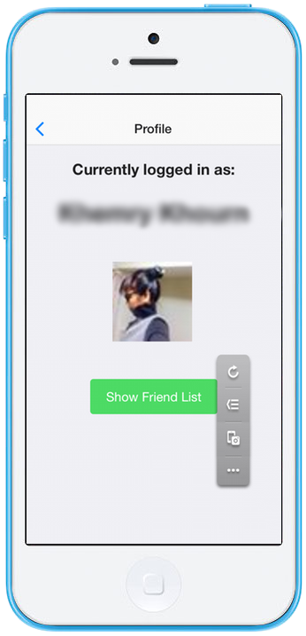
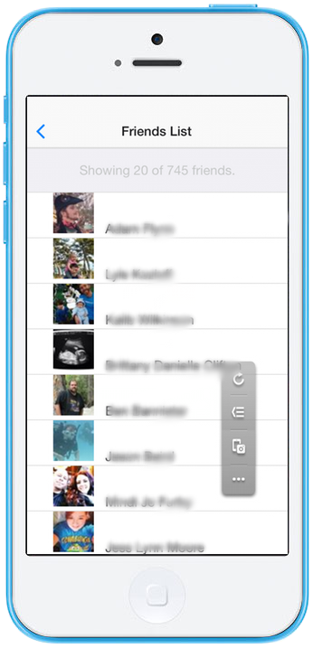
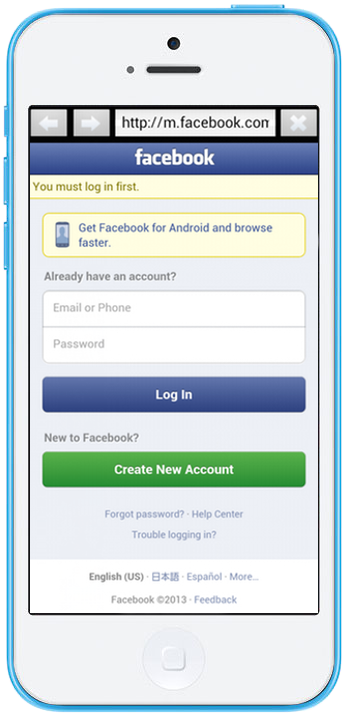

.. _monaca_with_facebook:

============================================
Facebook Client
============================================

.. rst-class:: right-menu

This sample app allows users to connect to Facebook from Monaca by using `Onsen UI <http://docs.monaca.mobi/onsen/index.html>`_ and InAppBrowser.

| *Tested Environments:* Android 4.3, iOS 7.1.1

.. raw:: html

  

    <iframe src="https://monaca.github.io/project-templates/15-facebook-client/www/index.html" style="max-width: 150%;"></iframe>
  

Prerequisite
^^^^^^^^^^^^^^^^^^^^^^^^^^^^

You are required to have *App ID/App Key* and *App Secret* by registering your Monaca app with Facebook Developer:
      
1. Go to `Facebook Developer Site <https://developers.facebook.com/>`_. Signin with Facebook account. If you don't have one, please signup.

2. Go to :guilabel:`Apps > Create a New App`.

  .. image:: images/facebook/1.png  
         :width: 700px

3. Fill in the display name and choose a category of your app. Then, click :guilabel:`Create App` button.

  .. image:: images/facebook/2.png
    :width: 500px

4. For security purpose, you will be asked to input some code. Click :guilabel:`Submit` button after input the shown code properly.

  .. image:: images/facebook/3.png
    :width: 500px

5. After a successful registration, a similar screen shown below will appear. You can see the App ID and App Secret here. You will need them later.

  .. image:: images/facebook/4.png
    :width: 700px

File Components
^^^^^^^^^^^^^^^^^^^^^^^^^^^^

======================== ===================================================================================================================================== 
``index.html``             Startup Page (Consists of Connect Screen)

``home_navigator.html``    Navigate to Connect Screen

``connect.html``           Connect Screen

``profile.html``           Facebook User Profile Screen

``list.html``              Friends List Screen

``js/app.js``              JavaScript file handling app interactions.

``styles/app.css``         Stylesheet file for the application
======================== =====================================================================================================================================

Required JS/CSS Components 
^^^^^^^^^^^^^^^^^^^^^^^^^^^^

============================ ============================
``jQuery``
``Onsen UI``
============================ ============================

Required Cordova Plugins
^^^^^^^^^^^^^^^^^^^^^^^^^^^^

============================ ============================
``InAppBrowser``
============================ ============================

HTML Explanation
^^^^^^^^^^^^^^^^^^^^^^^^^^^^^^^^^^^^^^^^^^^^^^^^^^^^^^^^^^^^^^^^^^^^^^^^^^^^^^^

The User Interface of this sample app is based on *Onsen UI*. For more information on *Onsen UI* tags and components, please refer to `Onsen UI Documentation <http://docs.monaca.mobi/onsen/index.html>`_.

The following contents of the HTML body of :file:`index.html` file loads the :file:`home_navigator.html` file at startup: 

.. code-block:: xml

  ...
    <ons-screen page="home_navigator.html"></ons-screen>   
  ...

The following contents of the HTML body of :file:`home_navigator.html` file will direct to the :file:`connect.html` file which is the Connect Screen: 

.. code-block:: xml

  ...
    <ons-navigator title="Sample App" page="connect.html"></ons-navigator>
  ...

The following contents of the HTML body of :file:`connect.html` file:

.. code-block:: xml

  ...
    

      
Welcome to Facebook!

        
      <ons-button type="cta" ng-click="connect()">Connect</ons-button>
    

  ...

corresponds to the screenshot below which allows a user to connect to Facebook:

The following contents of the HTML body of :file:`profile.html` file: 

.. code-block:: xml

  ...
    

      <h3>Currently logged in as:</h3>
      <h1>{{user_name}}</h1>
       
      
         
      <ons-button type="cta" ng-click="ons.navigator.pushPage('list.html', 'Friends List')">Show Friend List</ons-button>
    

  ...

corresponds to the screenshot below which shows the user's basic info and profile picture if the authentication is successful. When the :guilabel:`Show Friend List` button is tapped, the :file:`list.html` page is shown:

The following contents of the HTML body of :file:`list.html` file: 

.. code-block:: xml

  ...
    

        <ons-list align="left">
        
Showing 20 of {{len}} friends.

            <ons-list-item style="padding-left:10%" ng-repeat="friend in friends">
                {{friend.name}}
            </ons-list-item>
        </ons-list>
    

  ...

corresponds to the screenshot below which shows the friends list of the authenticated user:

JavaScript Explanation
^^^^^^^^^^^^^^^^^^^^^^^^^^^^^^^^^^^^^^^^^^^^^^^^^^^^^^^^^^^^^^^^^^^^^^^^^^^^^^^

The logic behind this app is based on *Graph API* and *InAppBrowser*. The `Graph API <https://developers.facebook.com/docs/reference/api/>`_ is the primary way that data is retrieved from Facebook or posted on Facebook. We use *InAppBrowser* to open a Facebook authentication page inside our app. This prevents opening of an external browser.

The JavaScript codes of this sample app is based on AngularJS. In AngularJS, each page, which requires interactions, contains its own controller function. In this sample, we have 3 controller functions: :envvar:`Connect_Ctrl`, :envvar:`Profile_Ctrl` and :envvar:`List_Ctrl` correspond to :file:`connect.html` page, :file:`profile.html` page and :file:`list.html` page, respectively. In order to create global vairables used between these controller functions, you need to create a service function to store those global variables as follows:

.. code-block:: javascript

  ...
    app.service('sharedProperties', function () 
    {
      var property;
      
      return {
        getProperty: function () 
        {
          return property;
        },
        setProperty: function(value) 
        {
          property = value;
        }
      };
    });
  ...

Inside this service function, we are able to get and set the value of the ``property`` variable which is a JSON object. This variale contains various variables needed to use between different pages.

Next, we will explain each controller function:

Connect_Ctrl
====================

:envvar:`Connect_Ctrl` controls the interactions and processes in :file:`connect.html` file. In other words, it handles the Facebook authentication process. In order to run this function, you will need to fill in your API Key, App Secret and a valid callback URL. Below is the JavaScript code of this function:

.. code-block:: javascript

  ...
  function Connect_Ctrl($scope, sharedProperties)
  {
    $scope.connect = function() 
    {
      var client_id = 'xxxxxxxxxxxxxxxx'; //YOUR App ID or API Key
      var client_secret = 'xxxxxxxxxxxxxxxx'; //// YOUR App Secret
      var redirect_uri = 'http://www.facebook.com/connect/login_success.html';  //// YOUR CALLBACK URL
      var display = 'touch';
      var authorize_url = "https://graph.facebook.com/oauth/authorize?";
          authorize_url += "client_id=" + client_id;
          authorize_url += "&redirect_uri=" + redirect_uri;
          authorize_url += "&display=" + display;
          authorize_url += "&scope=publish_stream,offline_access";
          
      var ref = window.open(authorize_url, '_blank', 'location=yes');
      ref.addEventListener('loadstart', function(event) 
      { 
        var loc = event.url;
        if(loc.indexOf(redirect_uri + "?") >= 0) 
        {
          var result = loc.split("#")[0];
          var accessToken = result.split("&")[0].split("=")[1];

          var url = 'https://graph.facebook.com/oauth/access_token?';
              url += 'client_id=' + client_id;
              url += '&client_secret=' + client_secret;
              url += '&code=' + accessToken;
              url += '&redirect_uri=' + redirect_uri;

          var req = new XMLHttpRequest();
          req.open("post",url,true);
          req.send(null);
          req.onerror = function(){alert("Fail to get access token!");};
          req.onload = function(evt) 
          {
            var temp = evt.target.responseText.split('&')[0].split('=')[1];
            accessToken = temp;
                  
            url = 'https://graph.facebook.com/me?fields=name,picture&access_token=' + accessToken;
            req = new XMLHttpRequest();
            req.open("get",url,true);
            req.send(null);
            req.onerror = function(){alert("Fail to get the information of the authenticated user!");};
            req.onload = function(evt) 
            {
              var json = jQuery.parseJSON(evt.target.responseText);
              var info_obj = new Object();
              info_obj.name = json.name;
              info_obj.profile = json.picture.data.url;
              
              url = "https://graph.facebook.com/me/friends?access_token=" + accessToken;
              req = new XMLHttpRequest();
              req.open("get",url,true);
              req.send(null);
              req.onerror = function(){alert("Error");};
              req.onload = function(evt)
              {
                var json = jQuery.parseJSON(evt.target.responseText);
                info_obj.friends_list = json;  
                //alert(JSON.stringify(json));
                var info_json = JSON.stringify(info_obj);
                sharedProperties.setProperty(info_json);
                ref.close();
                $scope.ons.navigator.pushPage('profile.html','Facebook Profile'); 
                $scope.$apply();
              };                  
            }  
          } 
        }
      });
    };
  }
  ...

Inside this controller, there is :envvar:`connect` function which leads user through Facebook authentication. This function is called when the :guilabel:`Connect` button is pressed. In order to gain access to Facebook, the :envvar:`Connect()` function needs to open a Facebook authentication page first (as shown below) via a *InAppBrowser* using :envvar:`window.open()` function.

After the user inputs his/her login information and presses :guilabel:`Log in` button, the app redirects to your callback URL. From the callback URL, Facebook code can be found. Then, an ``HttpRequest`` is sent with several parameters including the newly found Facebook code to ``"https://graph.facebook.com/oauth/access_token?..."`` in order to get access token.

If the request is successful, another ``HttpRequest`` is sent with several parameters including the newly found Facebook code to ``"https://graph.facebook.com/me?..."`` in order to get some information of the authenticated user, in this case, ``Name`` and ``Profile picture URL``.  

Next, if the request is successful, the retrieved info will then be stored in a JSON object (``info_obj``) for later use and another ``HttpRequest`` is sent with several parameters including the newly found Facebook code to ``"https://graph.facebook.com/me/friends?..."`` in order to get a list of friends of the authenticated user. If the request is successful, the retrieved data (in JSON format) of friends list will also be stored in the ``info_obj`` and updates into the global variable (``property``) inside ``sharedProperties`` service for using between controllers (pages).

Then, finally, the app redirects to :file:`profile.html` page.

Profile_Ctrl
=================

:envvar:`Profile_Ctrl` controls the interactions and processes in the :file:`profile.html` file. In other words, it displays the retrieved data after a successful authentication. Below is the JavaScript code of this function:

.. code-block:: javascript

  ...
    function Profile_Ctrl($scope, sharedProperties)
    {
      var content = jQuery.parseJSON(sharedProperties.getProperty());
      $scope.user_name = content.name;
      $scope.profile_pic = content.profile;
    }
  ...

This controller contains the assigment of some variables with the necessary data from the global variable inside the ``sharedProperties`` service.

List_Ctrl
=================

:envvar:`List_Ctrl` controls the interactions and processes in the :file:`list.html` file. In other words, it displays the retrieved data of friends list of the authenticated user. Below is the JavaScript code of this function:

.. code-block:: javascript

  ...
    function List_Ctrl($scope, sharedProperties)
    {

      var get_list = function()
      {
        setTimeout(function(){
           var content = jQuery.parseJSON(sharedProperties.getProperty());
          var friends = content.friends_list.data;
          var len = friends.length;
          $scope.len = len;
          
          len = 20;
          var tmp = new Array()
          var profile_pic;
          for(var i=0;i<len;i++)
          {
            profile_pic = "https://graph.facebook.com/"+ friends[i].id +"/picture";
            
            friends[i].pic_src = profile_pic;
            tmp[i] = friends[i];
           
          }
          
          $scope.friends = tmp;
          $scope.$apply();
        }, 0);

      };

      get_list();
    }
  ...

Inside this controller, there is :envvar:`get_list()` function which displays the list of friends retrieved from global variable (``property``) of the ``sharedProperties`` service.

