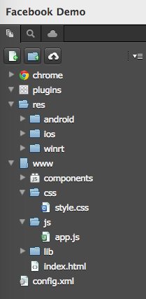
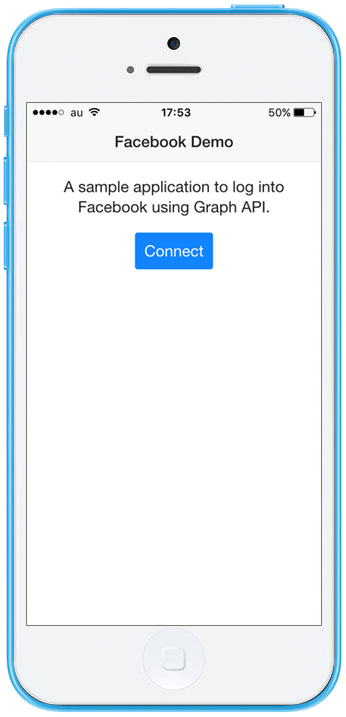
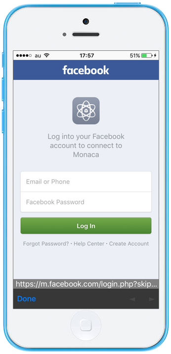

.. _monaca_with_facebook:

============================================
Facebook Demo
============================================

This is a sample Monaca app used to log into and log out of Facebook using `Graph API <https://developers.facebook.com/docs/reference/api/>`_.

| *Tested Environments:* Android 6.2, iOS 9.3.5

  .. figure:: images/facebook/5.png
     :width: 346px
     :align: left

  .. figure:: images/facebook/7.png
     :width: 346px
     :align: left

  .. rst-class:: clear

:download:`Click here to download the project <download/facebook.zip>`

Prerequisite
^^^^^^^^^^^^^^^^^^^^^^^^^^^^

In order to use this demo app, you are required to register your app with Facebook. Then, you will get its *App ID* and *App Secret* which will be used in this app later. 

Please follow the instruction below in order to register your app with Facebook:
      
1. Go to `Facebook for Developers <https://developers.facebook.com/>`_ and log in with your Facebook account.

2. Go to :menuselection:`My Apps --> Add a New App`.

  .. figure:: images/facebook/1.png
    :width: 700px
    :align: left

  .. rst-class:: clear

3. Select ``Website`` as the platform of your app.

  .. figure:: images/facebook/2.png
    :width: 700px
    :align: left

  .. rst-class:: clear

4. Fill in your app's name and click :guilabel:`Create New Facebook App ID`.

  .. figure:: images/facebook/3.png
    :width: 700px
    :align: left

  .. rst-class:: clear

5. Fill in your contact email and select a category of the app. Then, click :guilabel:`Create App ID`.

  .. figure:: images/facebook/4.png
    :width: 700px
    :align: left

  .. rst-class:: clear

6. Answer a security question.

7. Click :guilabel:`Skip Quick Start` button. Then, you will be forwarded to the app's Dashboard.

  .. figure:: images/facebook/9.png
    :width: 700px
    :align: left

  .. rst-class:: clear

8. Click on :guilabel:`Settings` and input your app domains and site URL. Then, click :guilabel:`Save Changes`. You can also find the *App ID* and *App Secret* here.

  .. figure:: images/facebook/10.png
    :width: 700px
    :align: left

  .. rst-class:: clear

File Components
^^^^^^^^^^^^^^^^^^^^^^^^^^^^

======================== ================================================================================
``index.html``             Startup page

``js/app.js``              JavaScript file handling app execution

``styles/app.css``         Stylesheet file for the application
======================== ================================================================================

Required JS/CSS Components 
^^^^^^^^^^^^^^^^^^^^^^^^^^^^

========================================= ============================
``Onsen UI (AngularJS is included)``
========================================= ============================

Required Cordova Plugins
^^^^^^^^^^^^^^^^^^^^^^^^^^^^

============================ ============================
``InAppBrowser``
============================ ============================

HTML Explanation
^^^^^^^^^^^^^^^^^^^^^^^^^^^^^^^^^^^^^^^^^^^^^^^^^^^^^^^^^^^^^^^^^^^^^^^^^^^^^^^

We are using `Onsen <https://onsen.io/>`_ for the user interface (UI) of this demo app.

Startup Page
====================

The following block code represents the UI of the startup page (see the screenshot below):

.. code-block:: HTML

    ...
    <ons-page ng-controller="HomeCtrl" ng-init="login_status=0">
        <ons-toolbar>
            
Facebook Demo

            

                <ons-button modifier="quiet" ng-click="Logout();">Log Out</ons-button>
            

        </ons-toolbar>

        

            
A sample application to log into Facebook using Graph API.

            <ons-button ng-click="ConnectToFB()" ng-hide="login_status">
                Connect
            </ons-button>
            

            ...
        

    </ons-page>  
    ...

     
    Startup Page

.. rst-class:: clear

Friend List page
====================

The following block code will show the friend list if the user is successfully logged in (see the screenshot below).

.. code-block:: HTML

    ...
    

        
Now showing 20 of {{friends.length}} friends:

    
        <ons-list modifier="inset">
            <ons-list-item ng-repeat="friend in friends | limitTo : 20">
                <ons-row>
                    <ons-col class="col-style" width="30%">
                        
                    </ons-col>
                    <ons-col class="col-style" width="70%">
                        
{{friend.name}}

                    </ons-col>
                </ons-row>
            </ons-list-item>
        </ons-list>
    
 
    ...

.. figure:: images/facebook/7.png
    :width: 346px
    :align: center
     
    Friend List

.. rst-class:: clear

JavaScript Explanation
^^^^^^^^^^^^^^^^^^^^^^^^^^^^^^^^^^^^^^^^^^^^^^^^^^^^^^^^^^^^^^^^^^^^^^^^^^^^^^^

In order to log into Facebook, we are using `Graph API <https://developers.facebook.com/docs/reference/api/>`_ and :ref:`InAppBrowser plugin <inappbrower_plugin>`. The Graph API is the primary way for apps to read and write to the Facebook social graph. We use InAppBrowser to open a Facebook authentication page inside the app without opening of an external browser.

     
    Facebook Login using InAppBrowser

.. rst-class:: clear

We use AngularJS in our code execution. In this app, we only have one controller, called ``HomeCtrl``. This controller will handle the login, logout and friend list retrieval from Facebook. Before running the app, please do not forget to fill in your App ID and App Secret.

.. code-block:: javascript

  ...
      app.controller('HomeCtrl', function($scope, $http) {
      console.log('home');
      var friendsList={};
      var login_accessToken;
      var accessToken;
      
      $scope.Logout = function(){
          console.log(login_accessToken);
          var url = "https://www.facebook.com/logout.php?access_token=" + login_accessToken + "&next='https://www.google.com'";
          var ref = window.open(url, '_blank', 'location=yes,clearsessioncache=yes,clearcache=yes,hidden=yes');
          
          $http.get(url).success(function(data){
             $scope.login_status = 0;
          });
      }

      $scope.ConnectToFB = function(){
          console.log('connect');
          var client_id = 'XXXXXXXXXXXXXXXX'; //your App ID or API Key
          var client_secret = 'XXXXXXXXXXXXXXXXXXXX'; //// your App Secret
          var redirect_uri = 'https://www.facebook.com/connect/login_success.html';  //// YOUR CALLBACK URL
          var display = 'touch';
          var authorize_url = "https://graph.facebook.com/v2.0/oauth/authorize?";
          authorize_url += "client_id=" + client_id;
          authorize_url += "&redirect_uri=" + redirect_uri;
          authorize_url += "&display=" + display;
          authorize_url += "&scope=public_profile,email";
          
          var ref = window.open(authorize_url, '_blank', 'location=yes');
          ref.addEventListener('loadstart', function(event)
          { 
              var loc = event.url;
              if(loc.indexOf(redirect_uri + "?") >= 0)
              {
                  ref.close();
                  var result = loc.split("#")[0];
                  console.log(loc);
                  login_accessToken = result.split("&")[0].split("=")[1];
                  
                  var url = 'https://graph.facebook.com/v2.0/oauth/access_token?';
                      url += 'client_id=' + client_id;
                      url += '&client_secret=' + client_secret;
                      url += '&code=' + login_accessToken;
                      url += '&redirect_uri=' + redirect_uri;
          
                  $http.post(url,null).success(function(data){
                      accessToken = data.split("&")[0].split("=")[1];
                      console.log(accessToken);
                      url = "https://graph.facebook.com/v2.0/me/taggable_friends?access_token=" + accessToken;
                      $http.get(url).success(function(data){
                          $scope.friends = data.data;
                          $scope.login_status = 1;
                      });
                  });
              }
          });
      } 
  });

