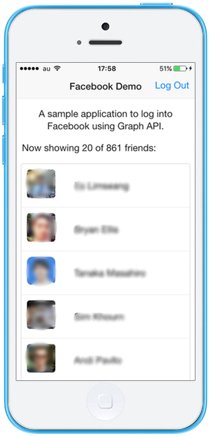

.. _monaca_with_facebook:

============================================
Facebook Demo
============================================

This is a sample app created in Monaca to log into and log out of Facebook using `Graph API <https://developers.facebook.com/docs/reference/api/>`_. wser.

| *Tested Environments:* Android 6.2, iOS 9.3.5

  .. figure:: images/facebook/5.png
     :width: 346px
     :align: left
     
     Banner Ads

  .. figure:: images/facebook/7.png
     :width: 346px
     :align: left
     
     Interstitial Ads

  .. rst-class:: clear

:download:`Click here to download the project <download/facebook.zip>`

Prerequisite
^^^^^^^^^^^^^^^^^^^^^^^^^^^^

You are required to have *App ID/App Key* and *App Secret* by registering your Monaca app with Facebook Developer:
      
1. Go to `Facebook Developer Site <https://developers.facebook.com/>`_. Signin with Facebook account. If you don't have one, please signup.

2. Go to :guilabel:`Apps > Create a New App`.

  .. image:: images/facebook/1.png  
         :width: 700px

3. Fill in the display name and choose a category of your app. Then, click :guilabel:`Create App` button.

  .. image:: images/facebook/2.png
    :width: 500px

4. For security purpose, you will be asked to input some code. Click :guilabel:`Submit` button after input the shown code properly.

  .. image:: images/facebook/3.png
    :width: 500px

5. After a successful registration, a similar screen shown below will appear. You can see the App ID and App Secret here. You will need them later.

  .. image:: images/facebook/4.png
    :width: 700px

File Components
^^^^^^^^^^^^^^^^^^^^^^^^^^^^

.. image:: images/facebook/8.png
    :width: 209px
    :align: center

======================== ================================================================================
``index.html``             Startup page

``js/app.js``              JavaScript file handling app execution

``styles/app.css``         Stylesheet file for the application
======================== ================================================================================

Required JS/CSS Components 
^^^^^^^^^^^^^^^^^^^^^^^^^^^^

========================================= ============================
``Onsen UI (AngularJS is included)``
========================================= ============================

Required Cordova Plugins
^^^^^^^^^^^^^^^^^^^^^^^^^^^^

============================ ============================
``InAppBrowser``
============================ ============================

HTML Explanation
^^^^^^^^^^^^^^^^^^^^^^^^^^^^^^^^^^^^^^^^^^^^^^^^^^^^^^^^^^^^^^^^^^^^^^^^^^^^^^^

In this demo app, we use `Onsen <https://onsen.io/>`_ for the UI of the app. 

Startup Page
====================

The following block code represents the UI of the startup page of the project (see the screenshot below).

.. code-block:: HTML

    ...
    <ons-page ng-controller="HomeCtrl" ng-init="login_status=0">
        <ons-toolbar>
            
Facebook Demo

            

                <ons-button modifier="quiet" ng-click="Logout();">Log Out</ons-button>
            

        </ons-toolbar>

        

            
A sample application to log into Facebook using Graph API.

            <ons-button ng-click="ConnectToFB()" ng-hide="login_status">
                Connect
            </ons-button>
            

            ...
        

    </ons-page>  
    ...

     
    Startup Page

.. rst-class:: clear

Friend List page
====================

The following block code will show the friend list if the user is successfully loged in. (see the screenshot below).

.. code-block:: HTML

    ...
    

        
Now showing 20 of {{friends.length}} friends:

    
        <ons-list modifier="inset">
            <ons-list-item ng-repeat="friend in friends | limitTo : 20">
                <ons-row>
                    <ons-col class="col-style" width="30%">
                        
                    </ons-col>
                    <ons-col class="col-style" width="70%">
                        
{{friend.name}}

                    </ons-col>
                </ons-row>
            </ons-list-item>
        </ons-list>
    
 
    ...

     
    Startup Page

.. rst-class:: clear

JavaScript Explanation
^^^^^^^^^^^^^^^^^^^^^^^^^^^^^^^^^^^^^^^^^^^^^^^^^^^^^^^^^^^^^^^^^^^^^^^^^^^^^^^

In order to log into Facebook, we are using `Graph API <https://developers.facebook.com/docs/reference/api/>`_ and :ref:`inappbrower_plugin`.
The Graph API is the primary way for apps to read and write to the Facebook social graph. We use InAppBrowser to open a Facebook authentication page inside our app. This prevents the opening of an external browser.

     
    Startup Page

.. rst-class:: clear

We use AngularJS in our code execution. In this app we only have one controller called ``HomeCtrl``. This controller will handle the login, logout and retrieve friend list from Facebook. Before running the app, please do not forget to fill in your App ID and App Secret.

.. code-block:: javascript

  ...
      app.controller('HomeCtrl', function($scope, $http) {
      console.log('home');
      var friendsList={};
      var login_accessToken;
      var accessToken;
      
      $scope.Logout = function(){
          console.log(login_accessToken);
          var url = "https://www.facebook.com/logout.php?access_token=" + login_accessToken + "&next='https://www.google.com'";
          var ref = window.open(url, '_blank', 'location=yes,clearsessioncache=yes,clearcache=yes,hidden=yes');
          
          $http.get(url).success(function(data){
             $scope.login_status = 0;
          });
      }

      $scope.ConnectToFB = function(){
          console.log('connect');
          var client_id = 'XXXXXXXXXXXXXXXX'; //your App ID or API Key
          var client_secret = 'XXXXXXXXXXXXXXXXXXXX'; //// your App Secret
          var redirect_uri = 'https://www.facebook.com/connect/login_success.html';  //// YOUR CALLBACK URL
          var display = 'touch';
          var authorize_url = "https://graph.facebook.com/v2.0/oauth/authorize?";
          authorize_url += "client_id=" + client_id;
          authorize_url += "&redirect_uri=" + redirect_uri;
          authorize_url += "&display=" + display;
          authorize_url += "&scope=public_profile,email";
          
          var ref = window.open(authorize_url, '_blank', 'location=yes');
          ref.addEventListener('loadstart', function(event)
          { 
              var loc = event.url;
              if(loc.indexOf(redirect_uri + "?") >= 0)
              {
                  ref.close();
                  var result = loc.split("#")[0];
                  console.log(loc);
                  login_accessToken = result.split("&")[0].split("=")[1];
                  
                  var url = 'https://graph.facebook.com/v2.0/oauth/access_token?';
                      url += 'client_id=' + client_id;
                      url += '&client_secret=' + client_secret;
                      url += '&code=' + login_accessToken;
                      url += '&redirect_uri=' + redirect_uri;
          
                  $http.post(url,null).success(function(data){
                      accessToken = data.split("&")[0].split("=")[1];
                      console.log(accessToken);
                      url = "https://graph.facebook.com/v2.0/me/taggable_friends?access_token=" + accessToken;
                      $http.get(url).success(function(data){
                          $scope.friends = data.data;
                          $scope.login_status = 1;
                      });
                  });
              }
          });
      } 
  });

