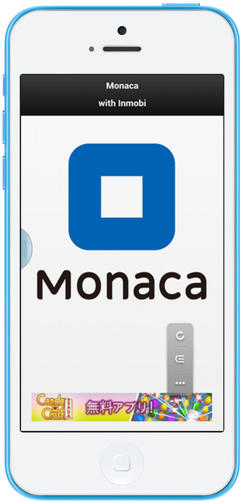

.. _inmobi_sample:

============================================
Inmobi Client
============================================

.. rst-class:: right-menu

In this page, we will show how to integrate the mobile ads using the mobile ads network Inmobi with Monaca. For more information about the Inmobi, please visit `Inmobi\'s website <http://www.inmobi.com/>`_ and `Inmobi Mobile Web Integration Guide <https://support.inmobi.com/monetize/integration/mobile-web/>`_.

.. raw:: html

  

    <iframe src="https://monaca.github.io/project-templates/17-inmobi-client/www/index.html"></iframe>
  

Prerequisites
============================================

Property ID from Inmobi
^^^^^^^^^^^^^^^^^^^^^^^^^^^^^^^^^^

To obtain a property ID from Inmobi, please follow the instruction below:

1. Create an Inmobi account at `Inmobi Site <https://www.inmobi.com/user/register.html?locale=en_us>`_.

2. After succesfully created an Inmobi account, log in to your Inmobi account. In the menu bar, select :guilabel:`MONETIZE` and fill in the necessary information. There are 4 types of property: ``Windows Phone``, ``iOS``, ``Android`` and ``Mobile Web``. In this sample, we choose the ``Mobile Web``. Then, click on :guilabel:`Add Property` button.

 .. image:: images/inmobi/inmobi_1.png
    :width: 90%

3. Next, you need to verify the newly created property which is required by Inmobi. In the property list, click on the :guilabel:`Verification` button (see the screenshot below).

 .. image:: images/inmobi/inmobi_3.png
    :width: 90%

4. To complete the verification, please add the following meta tag within the HTML head tag of your property URL.

  ::

    <html>
        <head>
            <meta name="inmobi-site-verification" content="4028cba631d63df10131e1d3191d00cb"> //replace your property ID here
        </head>
        <body>
            ...
        </body>
    </html>

5. To find out about your property ID, click on the :guilabel:`Settings` button (see the screenshot below).

 .. image:: images/inmobi/inmobi_5.png
    :width: 90%

6. Then, a dialog showing information of the selected property will appear. You can find the property ID in that dialog.

 .. image:: images/inmobi/inmobi_6.png
    :width: 90%

7. After adding the above code snippet, click on :guilabel:`Verify Now` button.

 .. image:: images/inmobi/inmobi_4.png
    :width: 90%

File Components
=========================

.. image:: images/inmobi/1.png
    :width: 200px
    :align: center

======================== ===================================================================================================================================== 
``index.html``             The startup Page

``js/inmobi.js``           An Inmobi library.

``css/style.css``          A stylesheet file for the application

``images/logo.png``        Monaca logo used in the application
======================== =====================================================================================================================================

Required JS/CSS Components
============================================

============================ ============================
``jQuerymobile``
============================ ============================

HTML Explanation
=======================

In the following code, we used *jQuery Mobile* for the header of the app. For more information on *jQuery Mobile* tags and components, please refer to `jQuery Mobile Demo <http://jquerymobile.com/demos/1.2.0/>`_. The remaining ``div`` tags are used to apply the CSS style we created earlier.

::

  ...
    <body>
      

        <h1>Monaca</h1>
        <h1>with Inmobi</h1>
      

    
      

        

             
        

      

      

        

     
      

    </body>   
  ...

JavaScript Explanation
===================================

The first part of this JavaScript code as shown below is about initializing an *inmobi* object called ``inmobi_conf``. There are several properties of this object such as:
  
- ``siteid`` (string): the property ID. 
- ``slot`` (number):  dimensions of the slot or box where ads appear on your app. The recommended slot value for most publishers is ``15``, which is a ``320x50`` slot that is compatible with rich media ads. For more information about other slot numbers, please refer to `Slot Sizes <https://support.inmobi.com/monetize/integration/mobile-web/mobile-web-integration-guide#integrating-the-ad-code>`_.
- ``test`` (boolean): the state of your app. During development and testing, it should be set to true, to ensure that only test ads are sent. When you set test to false, you will receive live ads.
- ``manual`` (boolean): if set to ``"true"``, the ad is not loaded automatically at page load. The ad can then be fetched at some other time in the life cycle of the page, using the :envvar:`getNewAd()` function.
- ``autoRefresh`` (number): the duration of auto refresh of text and banner ads. The refresh interval is in seconds and its minimum accepted value is 20. In this sample, the ads is auto refreshed every minute.
- ``targetWindow``: allows you this control whether to open a click URL/Landing Page in the same window or in a new window. To open click URLs in a new window, the parameter value must be set to ``"_blank"``. The default value is ``"_top"`` which opens the click URL in the same window.

::

     

There are 2 functions in the JavaScript code of this app: :envvar:`onDeviceReady()`, and :envvar:`showAds()`.

onDeviceReady() function
^^^^^^^^^^^^^^^^^^^^^^^^^^^^^^^

The :envvar:`onDeviceReady()` includes :file:`inmobi.js` file when PhoneGap is fully loaded. Below is the JavaScript code of this function:

::

    

.. note:: :file:`inmobi.js` must not be included as usual in the header  by using (````). This file is needed to be included after PhoneGap is fully loaded inside :envvar:`onDeviceReady()` function as shown above. 

showAds() function
^^^^^^^^^^^^^^^^^^^^^^^^^^^^^

The :envvar:`showAds()` function requests a new ads from the Inmobi. Below is the JavaScript code of this function:

::

    

For more information regarding *inmobi* JavaScript API, please refer to `this <http://developer.inmobi.com/wiki/index.php?title=JavaScript>`_.

