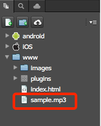
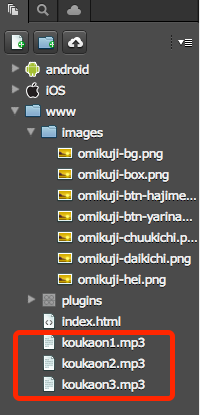

==================================
Playing Sound and Music
==================================

.. rst-class:: right-menu

In Monaca, you can use the following ways to play sound and music:

* Use HTML5 <audio> tag. 
* Use PhoneGap Media API. 

.. note:: This is just a sample code and may not work correctly with some OS versions or devices.

Playing Sound from External Source
===================================================

HTML5 <audio> tag can be used to play sound located in the Internet by specifying its URL. This sample uses <audio> tag and specifies an external mp3 source. 

index.html

::

  <!doctype html> 
  <html> 
    <head> 
      <meta charset="UTF-8" />
      <meta name="viewport" content="width=device-width, user-scalable=no">
      
    </head> 
    <body> 
      <audio src="http://audio.ibeat.org/content/p1rj1s/p1rj1s_-_rockGuitar.mp3" controls></audio>
    </body> 
  </html>

.. note:: Please be aware that some devices or OS versions do not support audio playback.

Playing the Sound Located in Monaca Project
===================================================

This sample plays a sound file located under *www* directory of the project. There are two ways to playback a local sound file. 

* Use HTML5 <audio> tag. 
* Use PhoneGap Media API. 

--------------------------------------------------------------
Using <audio> Tag and Locating Local Sound File
--------------------------------------------------------------

Most iOS devices are capable of playing local sound files by using <audio> tag. However, Android devices do not have this capability yet. 

index.html

::

  <!doctype html> 
  <html> 
    <head> 
      <meta charset="UTF-8" />
      <meta name="viewport" content="width=device-width, user-scalable=no">
      
    </head> 
    <body> 
      <audio src="sample.mp3" controls></audio>
    </body> 
  </html>

Using PhoneGap Media API to Play Sound
==================================================================

This API can be used to play sound located locally. It is compatible with both iOS and Android devices. Following sample code loads and plays :file:`sample.mp3` file located in a Monaca project. 

*index.html*

.. literalinclude:: download/media/en/index.html
   :language: html

---------------------------------------------
Using Media API to Play Sound Effects
---------------------------------------------

This sample modifies `Fortune Teller App <http://docs.monaca.mobi/sampleapp/samples/omikuji>`_ and adds a sound effect to it. This sample app will have different sounds for each fortune result. You will need to place *mp3* files and modify :file:`index.html` as follows.

You can download the complete source code here. 

:download:`download/media/omikuji.zip`

*index.html*

.. literalinclude:: download/media/en/index1.html
   :language: html

